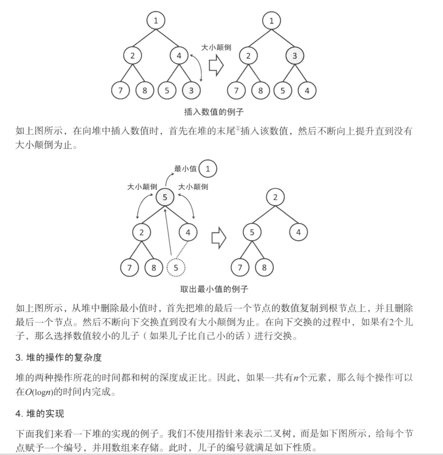

## 学习笔记
### 一、绘制地图

- 空白节点问题，需要设父元素line-height 0 或者font-size 0
- mac which = ? 怎样操作 三指按压移动 或者 双指按压+单指移动
### 二、广度寻路
- form onsubmit 阻止提交 return false
- 地图使用了br换行，不能使用children, 可以使用document.getElementsByClassName('cell')
- 使用递归为深度搜索， 一个点向四周寻路，把没有障碍的点存进队列，先进先出，拿一个值出来判断是否为终点，不是的话，再找四周的点，继续循环，直到队列中的空白点都不是终点。
### 三、处理寻路路径
- 添加四个斜角的方向
- 每一个点都记录前驱点，在找到终点后，再循环这个table数组，一个个找前驱点，直到始点为止。
### 三、启发式寻路
- 原理：两点之间最近的点，即为最优点
- return null undefined 的区别  从语意上，null为空值，还是一个值    undefined 是未定义的意思
- 删除数组中的元素，反续元素会向前移位。把这个位置的与最后的值交换，然后把最后位置的值pop出数组 O(N)->O(1)
- 箭头函数 {}花括号问题 当箭头函数中表达式部分为语句块的时候，箭头函数并不会自动地返回一个值，需要手动加上return 语句。
- minHeap  最小堆
 入栈  从末尾入栈 如果父节点的值比这个值大，即交换位置   父节点-> parseInt((len-1)/2)
 出栈  顶端的值 pop弹出 末尾的值的替换这个位置 此时比较其子节点的值（i=0  i*2+1 i*2+2） 交换位置，直到不需要交换.

