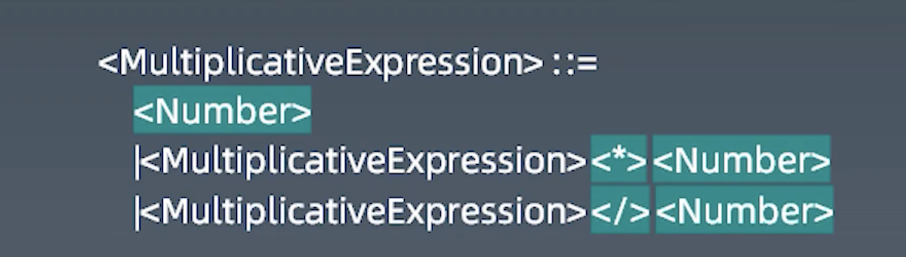
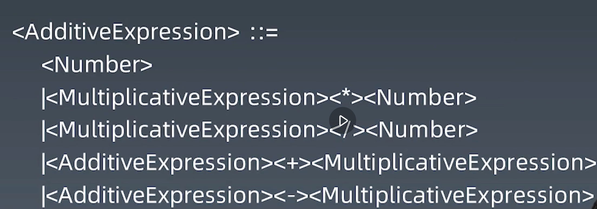

## 学习笔记
### 一、四则运算
- tokenNumber operator whitespace lineterminator
- AST 抽象语法树 （Abstract Syntax Tree)
- LL 从左到右解析 LR   left right

- TokenNumber: 1 2 3 4 5 6 7 8 9 0 的组合
- Operator: +、-、*、/ 之一
- Whitespace：<sp>
- LineTerminator：<LE> <CR>
### 二、正则表达式
- 通过正则捕获代码表达式中的tokenNumber operator
### 三、词法分析 tokenize 完善
- regexp.lastIndex 下一次开匹配的位置
- 过滤其它类型字符
- 迭代器 generator
- 添加EOF end of file

### MultiplicativeExpresstion

### AddicativeExpression

### 总结

一脸懵逼, 跟着敲