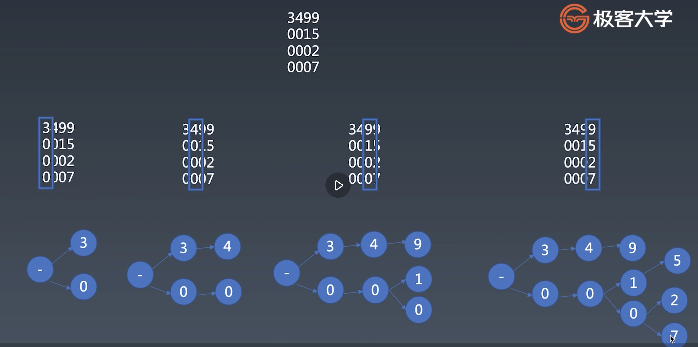
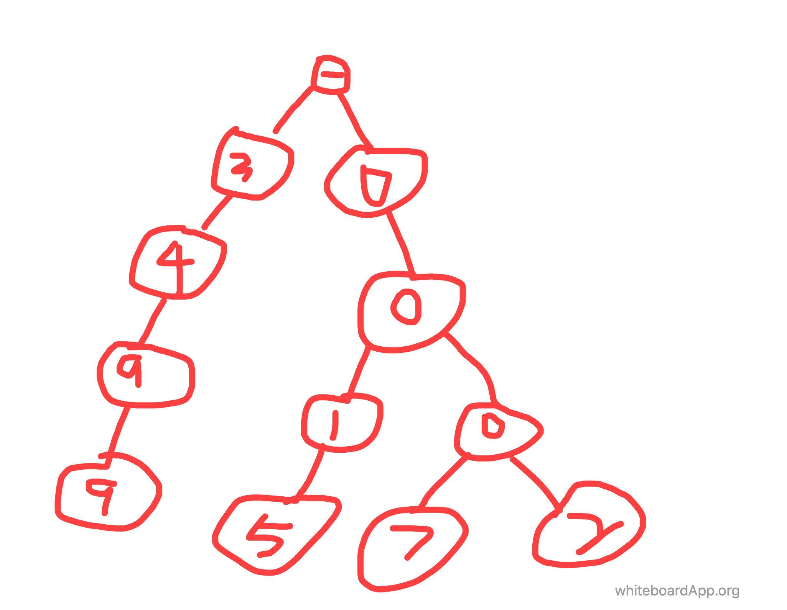
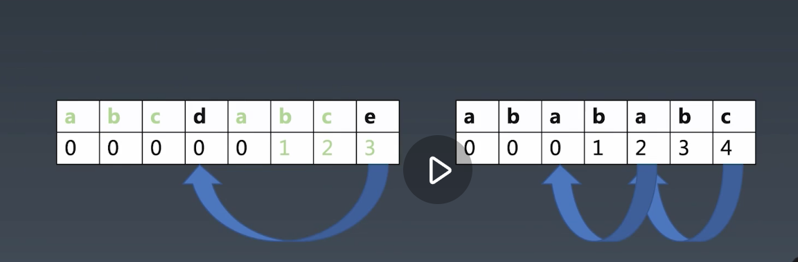

### 学习笔记

#### 一、字典树 Trip

先看图

关键词-公共前缀，把字符串的公共前缀合并在一起，形成树状结构


- 插入代码描述
```javascript
insert(word) {
    let node = this.root;   // 根节点
    // 遍历字符串
    for(let n of word) {
        // 节点不存在，添加新节点，赋值空对象
        if(!node[n]) {
            node[n] = Object.create(null);
        }
        // 灵魂所在 对象的地址引用的原因，node会指向子点节的地址，不需要引用新变量保存
        node = node[n];
        // 添加截止符 并记录到达位置的数量
        if(!('$' in node)) {
            node['$'] = 0;
        }
        node['$']++;
    }
}

```
- 相关知识点记录

1. for in / for of ?

简单描述：for in是ES5标准，遍历key. for of是ES6标准，遍历value.

2. Object.create(null)

创建一个空对象，没有对象原型链上的属性

3. in 操作符  hasOwnProperty ?

in判断的是对象的所有属性，包括对象自身及其原型的属性；
而hasOwnProperty则是判断对象自身是否具有某个属性

4. const $ = Symbol('$');  symbol值都是唯一

- 求出现最多的字符串

在插入的时候，最后的截止符，记录了出现次数

```javascript
most() {
    let mostNum = 0;
    let mostWord = '';
    // 判断是否有截止符，有则判断其值是否比mostnum大，有则记录
    function visit(node, word) {
        if(node['$'] && node['$'] > mostNum) {
            mostNum = node['$'];
            mostWord = word;
        }
        for(let key in node) {
            // 自顶而下，拼接上每个节点的前缀，直到$,没有
            visit(node[key], word + key);
        }
    }
    visit(this.root, '');
}

```

1. 模糊搜索

```javascript
    search(keyWord) {
        let node = JSON.parse(JSON.stringify(this.root));
        for (let c of keyWord) {
            node = node[c];
        }
        // 遍历拼接再打印结果
        this.printSearchResult(node, keyWord);
    }

    printSearchResult(node, perWord) {
        let traversal = (node, word = '') => {
            if (node['$']) {
                console.log(perWord + word);
            }
            for (let key in node) {
                traversal(node[key], word + key);
            }
        }
        traversal(node);
    }

```

2. 搜索指定字符串出现的次数

```javascript
    frequency(str) {
        let node = this.root;
        for (let c of str) {
            if (!node[c]) {
                console.log(str + '出现的次数为：0');
                break;
            } else {
                node = node[c];
            }
            
        }
        if (node['$']) {
            console.log(str + '出现的次数为：' + node['$']);
        }
    }

```

3. top排行

伪代码：调用most 方法，取出最大值后，删除该节点，依次调用，直到指定的top数量


#### 二、KMP

由三个大佬的名字组成，在长字符串中匹配是否包含子字符串

- 暴力匹配（伪代码） 一一匹配

```javascript
    let source = 'abcdabcdabcf';
    let pattern = 'abcdabcf';
    // 开始
    abcdabcdabcf
    |
    abcdabcf
    // 不成功，比较下一位
    abcdabcdabcf
     |
     abcdabcf
    // 不成功，比较下一位
    abcdabcdabcf
      |
      abcdabcf
    // 不成功，比较下一位
    abcdabcdabcf
       |
       abcdabcf
    // 不成功，比较下一位
    abcdabcdabcf
        |
        abcdabcf
    // 匹配成功

```

- kmp 

```javascript
    let source = 'abcdabcdabcf';
    let pattern = 'abcdabcf';
    // 开始
    abcdabcdabcf
           |
    abcdabcf
    00001230    //前一位对应的下标是3 
    // 可以发现上面的跟d 跟 f不匹配，但pattern串中是有重复的，
    // pattern串的d右移，对于上source中的位置
    abcdabcdabcf
           |
        abcdabcf
    
    // 匹配成功

```

看上面的伪代码，kmp明显效率很高，利用了前面重复的特性。

对于pattern的重复性，需要用一个表格来记录，课程中的重复个数，后一个记录前一位的

```javascript
// 个人理解跟课程的有出入 重复数直接记录在当前位置，不记录在下一处。只有在匹配的时候，冲突点取上一位的值来移动即可
//i 后缀指针   j 前缀指针
// i 默认为 1不需要跟自己对比  j 默认为0, j可代表前端重复数 或其对应的下标数 ****** 这点很重要
a b c d a b c e        
0                      // 初始化 第一位填充0  i = 1   j = 0 默认值
0 0                    // **********  开始匹配 后缀i 跟前缀j 的值不相等，标识0  i++ 对比下一位
0 0 0                  // **********  此时 i = 2, j =0, 还是不相等，不重复 i++ 再对比下一位
0 0 0 0                // **********  此时 i = 3, j =0, 还是不相等，不重复 i++ 再对比下一位
0 0 0 0 1              // **********  此时 i = 4, j =0, 发现相等，记录 j++ 记录next[i] = j; i++ 再对比下一位; ->课程中是i++,j++ 再记录位置，所以记录在下一位的位置
0 0 0 0 1 2            // **********  此时 i = 5, j =1, 发现相等，记录 j++ 记录next[i] = j; i++ 再对比下一位;
0 0 0 0 1 2 3          // **********  此时 i = 6, j =2, 发现相等，记录 j++ 记录next[i] = j; i++ 超出长度
0 0 0 0 1 2 3 0         // **********  此时 i = 7, j =3, 还是不相等，不重复 i++ 超出长度，结束

// 观察法
a // 没有公共前后缀 0
a b // 没有公共前后缀 0
a b c // 没有公共前后缀 0
a b c d // 没有公共前后缀 0
a b c d a// 有一组公共前后缀 1
a b c d a b// 有两组公共前后缀 2
a b c d a b c// 有一组公共前后缀 3
a b c d a b c e//没有公共前后缀   0

// 观察的结果跟前面伪代码逻辑一样
```

```javascript
// 另一个例子
a b a b a b c

// 先用观察法

a // 0
a b // 0
a b a // 1
a b a b // 2
a b a b a // 3    aba  aba 
a b a b a b // 4   abab abab
a b a b a b c // 0 

// 伪代码
//i = 1 后缀指针   j = 0 前缀指针

a b a b a b c
0             // 默认
0 0           // i = 1 j=0   !==  i++
0 0 1         // i = 2 j=0  == j++  next[i] = j i++
0 0 1 2       // i = 3 j=1  == j++  next[i] = j i++
0 0 1 2 3     // i = 4 j=2  == j++  next[i] = j i++
0 0 1 2 3 4   // i = 5 j=3  == j++  next[i] = j i++
0 0 1 2 3 4 0 // i = 6 j=4  !==  i++ 超出范围，结束

```

```javascript
// *****特殊例子****
aabaaac
// 先用观察法

a // 0
a a // 1
a a b // 0    
a a b a // 1    a
a a b a a // 2    aa
a a b a a a // 2   aa
a a b a a a c // 0 

// 伪代码
//i = 1 后缀指针   j = 0 前缀指针

a a b a a a c
0             // 默认
0 1           // i = 1 j=0   ==  j++, next[i] = j, i++
0 1 0         // i = 2 j=1  !=   i++  j = 0 ？？？
0 1 0 1       // i = 3 j=0  == j++  next[i] = j i++
0 1 0 1 2     // i = 4 j=1  == j++  next[i] = j i++
0 1 0 1 2 2   // i = 5 j=2  !=  这个时间j 大于零 要取其前一位的值对比是否跟i的值对比，如果还不成立，直到j=0  重点
0 1 0 1 2 2 0 // i = 6 j=2  !==         i++ 超出范围，结束

```
代码实现

```javascript
    function next(pattern) {
        let len = pattern.length;
        let next = new Array(len).fill(0);
        let j = 0 // j前缀指针 i后缀指针   
        for(let i = 1; i < len; i++) {
            
            if (pattern[i] === pattern[j]) {
                j++;
                next[i] = j;
            } else {
                // ***** j位置回滚
                while(j > 0) {
                    j = j - 1;
                    if(pattern[i] === pattern[j]) {
                        j++;
                        next[i] = j;
                        break;
                    }
                }
            }
 
        
        }
        console.log(next)
    }
```
匹配过程

```javascript
    
    function match(source, pattern) {
       let j = 0;  // i为 source的对比下标 j为pattern的对比下标
        for(let i = 0; i < source.length; i++) {
            if (source[i] === pattern[j]) {
                j++;
            } else {
                // ***** pattern位置回滚
                while(j > 0) {
                    j = next[j-1]; // 通过next 函数处理过的前缀重复数组
                    if(source[i] === pattern[j]) {
                        j++;
                        break;
                    }
                }
            }

            if( j === pattern.length) {
                return true;
            }
        }
        return false;
    }
```

- [力扣 28 实现 strStr() 函数]('https://leetcode-cn.com/problems/implement-strstr/')

> 给定一个 haystack 字符串和一个 needle 字符串，在 haystack 字符串中找出 needle 字符串出现的第一个位置 (从0开始)。如果不存在，则返回  -1。
示例 1:
输入: haystack = "hello", needle = "ll"
输出: 2
示例 2:
输入: haystack = "aaaaa", needle = "bba"
输出: -1
说明:

当 needle 是空字符串时，我们应当返回什么值呢？这是一个在面试中很好的问题。
对于本题而言，当 needle 是空字符串时我们应当返回 0 。这与C语言的 strstr() 以及 Java的 indexOf() 定义相符。
```javascript
    // 改造下kmp的 match
    match(source, pattern) {
        if (pattern.length === 0) {
            return 0;  // 是空字符串时我们应当返回 0
        }
        let next = this._next(pattern);
        let j = 0;  // i为 source的对比下标 j为pattern的对比下标
         for(let i = 0; i < source.length; i++) {
             if (source[i] === pattern[j]) {
                 j++;
             } else {
                 // ***** pattern位置回滚
                 while(j > 0) {
                     j = next[j-1]; // 通过next 函数处理过的前缀重复数组
                     if(source[i] === pattern[j]) {
                         j++;
                         break;
                     }
                 }
             }
 
             if( j === pattern.length) {
                 // i j 指针重叠 
                 return i - j + 1;   // 存在返回 返回出现的第一个位置
             }
         }
         return -1;  // 如果不存在，则返回  -1。
     }
```

#### 二、Wildcard

- \* 表示匹配任意数量的任意字符
- ？ 表示任意字符
- 疑问点， 前面的星号为什么发尽量少匹配，最后一个星尽量多匹配
- ？使用正则，替换成任意字符 \s\S  不可见 加 可见 为任意字符   单纯处理星号的情况


