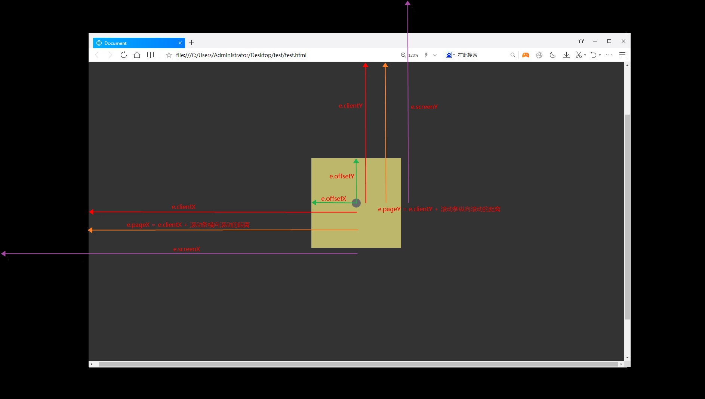

学习笔记

### 一、使用proxy 实现双向绑定
强大但危险的东西！
应用中发现一些问题
- effect 是立即调用回调函数的，回调函数里读取了对象的值，对把改对象进行依赖收集
- usedReactivties 里面存在大量无用数据，对象一直在变
- 解除操作
```javascript
po.removeBind(object);

function removeBind(obj) {
    reactivties.delete(obj);
    callbacks.delete(obj);
}

```
### 二、拖拽

#### 1. clientX/pageX/screenX/offsetX

- screenX 和screenY
参照点：电脑屏幕左上角
screenX：鼠标点击位置相对于电脑屏幕左上角的水平偏移量
screenY：鼠标点击位置相对于电脑屏幕左上角的垂直偏移量

- clientX和clientY
参照点：浏览器内容区域左上角
clientX：鼠标点击位置相对于浏览器可视区域的水平偏移量（不会计算水平滚动的距离）
clientY：鼠标点击位置相对于浏览器可视区域的垂直偏移量（不会计算垂直滚动条的距离）

- pageX和pageY
参照点：网页的左上角
pageX：鼠标点击位置相对于网页左上角的水平偏移量，也就是clientX加上水平滚动条的距离
pageY：鼠标点击位置相对于网页左上角的垂直平偏移量，也就是clientY加上垂直滚动条的距离

- offsetX和offsetY
offsetX：鼠标点击位置相对于触发事件对象的水平距离
offsetY：鼠标点击位置相对于触发事件对象的垂直距离



#### 2. createRange 比较少用到
> 概念： 
Range用来标识页面的范围，可以用两个边界点来生成一个Range对象

- 创建range对象 document.createRange()
- setStart setEnd 添加边界点
- insertNode 案例使用到的。插入一个节点，节点将被插入Range的起始边界点处。

#### 3. textContent、innerText、innerHTML
- innerText/innerHTML 前者只返回文本 后者还有标签
- innerText/textContent 前只受css影响（display:none 会不显示） 后者则不受css影响，还可以显示其中的style sript的文本


#### 4. childNodes、children、firstChild

- childNodes 返回指定元素的子节点集合 包括元素节点及文本
- firstChild 第一个节点，可能是元素节点也可能是文本 比较换行的空格
- children 返回指定元素的子元素节点


