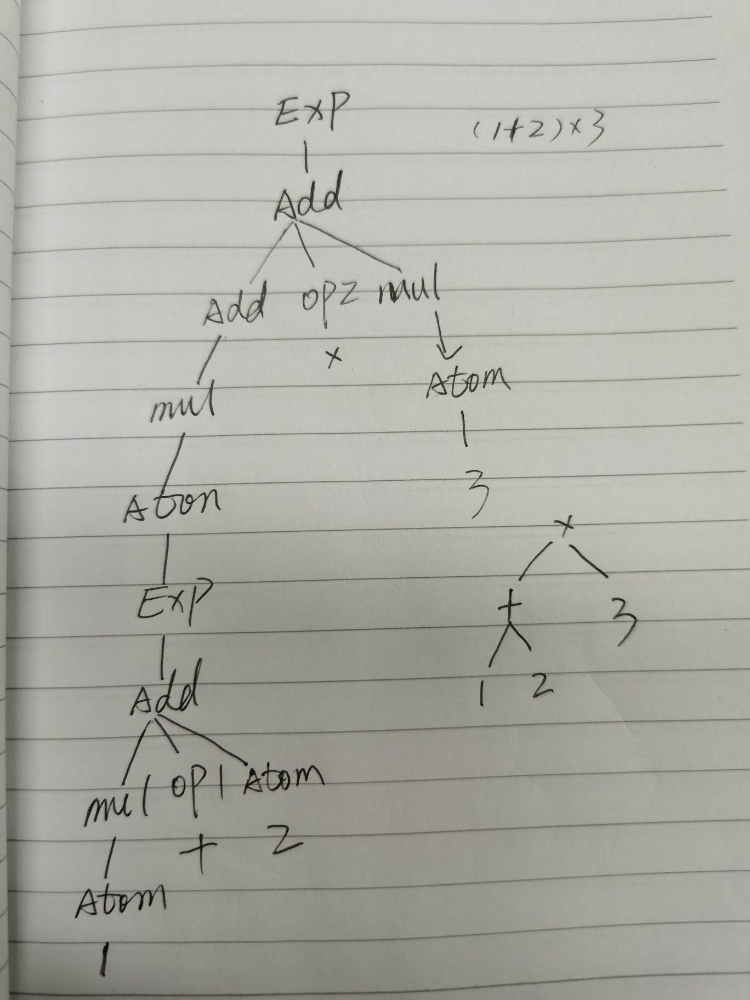

### week 6

---
### 一、语言按语法分类

1. 非形式语言

日常所说的英文 中文，没有固定语法  比如 long time no see 也是能理解的。

2. 形式语言

大部分计算机里面的都是形式语言，有严格的语法

按“乔姆斯基谱系”分类

- 0 无限制文法
- 1 上下文相关文法
- 2 上下文无关文法
- 3 正则文法  regular


0123是包含关系

---
### 二、产生式（BNF）

- 语法结构名： 用尖括号括起来的名称
- 语法结构分两种
> * 基础结构（终结符  terminal symbol）
> * 复合结构 （非终结符） 需要其它语法结构来定义

### 这里的终结不是程序终结的意思, 类似树节点的意思 ###

- 终结符： 使用字符串表示 就引号加其中的字符
- |   表示或的关系
- \*  表示重复多次
- \+  至少一次
- ::= 是“被定义为”的意思，老师没提到的！

### demo： （a|b）+ 意思就是说 a或b至少出现一次 ### 

第三周懵逼的东西又回来了，让我们回顾下

四则运算，被处理成token -> 乘法表达式 -> 加法表达式 -> 最后拿到表达式

- 乘法表达式 -- 单独的数字 或 乘法表达式 * 数字 或 乘法表达式 / 数字
```
<multiplicativeExpreesion> ::= <number> | <multiplicativeExpreesion> "*" <number> |  <multiplicativeExpreesion> "/" <number>
```

- 加法表达式 -- 单独乘法表达式 或 加法表达式 + 乘法表达式 或 加法表达式 - 乘法表达式
```
<additiveExpresstion> ::= <multiplicativeExpreesion> | <additiveExpresstion> "+" <multiplicativeExpreesion> | <additiveExpresstion> "-" <multiplicativeExpreesion> | 
```
- 最终 表达式  加法表达式加 EOF(end of file)
```
<expression> ::= <additiveExpresstion><EOF>
```
### 1 + 2 * 3  伪代码 ###
```
expression
    |   additiveExpresstion
    |   |   multiplicativeExpreesion
    |   |   |   match number.......... 1
    |   |   _
    |   |   match '+'
    |   |   multiplicativeExpreesion
    |   |   |   match number.......... 2
    |   |   |   match '*'
    |   |   |   match number ......... 3
    |   |   _
    |   |   oprate ................... * // 2 3 * 相当于 2 * 3
    |   oprate ....................... + // 1 (2 3 *) + 相当于 1 +（2 * 3）
    EOF

```
### 作业：（）圆括号分组产生式 parenthese ###
左括号 和 右括号 之间的token 嵌套新的表达式 ? 新的产生式？
```
Exp -> AddExp  // Expression 下面只有一种可能性，就是AddExp
AddExp -> AddExp opt1 MulExp | MulExp // addExp 下面有两种可能性： 乘法表达式 或（加法表达式 操作符 乘法表达式）
opt1 -> + | -  // 加法操作符
MulExp -> MulExp opt2 AtomicExp | AtomicExp  // ！！！这里不再是数字终止符， 嵌套表达，也可以理解为原子表达式
opt2 -> * | /   // 乘法操作符
AtomicExp -> "(" Exp ")" | number  // 原子表达式 可能是数字 可 一个 被圆括号 包起来的表达式
```
通过上面的规则，尝试图解(1 + 2) * 3
```
Exp
|   AddExp
|   |   MulExp
|   |   |   AtomicExp
|   |   |   | match "("  --------- 发现左括号
|   |   |   | Exp        --------- 递归嵌套
|   |   |   |   AddExp
|   |   |   |   |   MulExp
|   |   |   |   |   |   AtomicExp
|   |   |   |   |   |   |   match number.......... 1
|   |   |   |   |   |   _   
|   |   |   |   |   _
|   |   |   |   |   match "+"
|   |   |   |   |   MulExp
|   |   |   |   |   |   AtomicExp
|   |   |   |   |   |   |   match number.......... 2
|   |   |   |   |   |   _   
|   |   |   |   |   _
|   |   |   |   _
|   |   |   |   oprate ........................... +  
|   |   |   | match ")"   ----- 发现右括号
|   |   |   _
|   |   MulExp
|   |   |   match '*'
|   |   |   AtomicExp
|   |   |   |   match number ....................... 3
|   |   |   _
|   |   _
|   |   oprate ..................................... *
|   _
EOF

```


### 三、通过产生式理解乔姆期基普系

- 0 无限制文法
```
?::=?
// ::= 左边右边可以是多个非终结符，再回顾上面的概念，非终结符就是复合结构 需要其它语法结构来定义

```
- 1 上下文相关文法
```
？<a>?::=？<a>?
// 故名思义 上下文相关 表达式里面的拿外面的上下文影响
```
- 2 上下文无关文法

```
<a>::= 等号的左边以一个非终结符开头
```
- 3 正则文法  regula
```
<a>::=<a>? √
<a>::=?<a> x
左结合
```

### js是上下文无关文法 还是上下文无关文法  还是正则文法 ###
表达式方法为正则文法，整体是上下文无关文法 个部是上下文相关文法
特例 
- 1**2\**3 ->乘方符\*\* 右结合  不是正则文法了


- get 为关键字，后面如果跟冒号，就是属性访问
```
{
    get a { return 1},
    get: 1
}

```

产生式是五花八门的，js的产生式？
> TODO 

### 四、现代语言分类

大部分编程语言的主体都是上下文无关文法

除了乔姆期基普复杂的文法分类，还其它分类

按形式语言的-用途分类
- 数据描述语言
>  HTML JSON CSS SQL XAML
- 编程语言
> C C++ JS Java Python Ruby


按形式语言的-表达分类
- 声明式
>  HTML JSON CSS SQL XAML
- 命令式
> C C++ JS Java Python Ruby

### 五、编程语言的性质

1. 图灵完备性

所有可计算的问题都可用来描述的语言 就是具备图灵完备性的

- 声命式 lambada
  1. 递归

- 命令式 图灵机
  1. goto
  2. if while
2. 动态与静态
    - runtime 动态、运行时
    - compiletime 静态（编译时？历史习惯，都这么叫）、开发时，这个时候就发生类型检查

    java的反射机制，运行时需要没有类型了，但还是可以通过反射机制找到--半静态半动态

3. 强类型与弱类型

强类型语言是不会发生类型转换的，js是弱类型
在 string 跟boolean 判断中， boolean会被转换成number进行比较， string跟number 相加会把number转string

### 六、一般命令式编辑语言结构

- Atom 原子
    - identify  变量
    - literal  直接量   比如 1213的字符串
- Expression 表达式  原子加上操作符再加上一些辅助符号组成
    - atom
    - oprator
    - punctuator
- Statement  语句 由一些 Expression 跟上一些 Keywords（if、While）和一些 Punctual 组成。
    - expression
    - keywords
    - punctuator
- Structure  结构化 在语句的基础上加一些概念来整理代码
    - function
    - class
    - namespace
- Program  顶级的程序级别了
    - program
    - package 
    - library
    - module

后面通过 语法 -> 语义 -> 最后运行时来重学js


