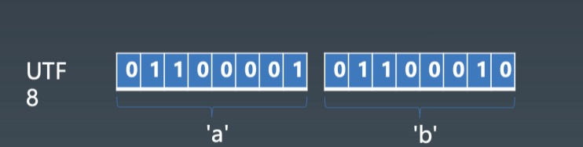
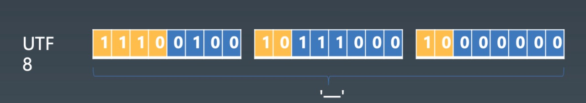

### 八、String

- character
- code point
- encoding

#### 一、字符集

- asc|| 常用的127个字符组成  大写26 小写26 数字 0-9的数字  以为制表符 特殊符号等 美国最早发明的，中文没法用
- unicode 整体个很多国家的编码 划分了很多片区
- ucs ???  0000 ffff
- gb 国标
    - gb2312
    - gbk bg13000
    - gb18030
- iso-8859 ??? 东欧国家
- big5 台湾

一些区域或国家的编码格式它们都是互相冲突的，code point 冲突，不同混合使用。但他们都是兼容asc two的

#### 二、编码
### 1B = 8bit 一字节为8比特位 ###
- UTF-8    1B   中文需要3字节来表示
- UTF-16   2B

### 写一段 JS 的函数，把一个 string 它代表的字节给它转换出来，用 UTF8 对 string 进行遍码 ###

- unicode
为世界所有字符都分配一个唯一的数字编号 16进制
范围人0x000000 到0x10FFFF ，Unicode相当于一张表，建立了字符与编号之间的联系
但是Unicode 只是一种规定，规定了每个字符的数字编号是什么，但没有规定这个编号是怎样存储！直接转成二进制存存储吗？现在就可以引出utf-8 utf-16 32 存储方案了。
- utf-8 使用变长字节表示 字节数1到4个不等
    - 规则
        1. 对于1个字节的符号，字节的第一位设为 0，后面的7位为这个符号的 Unicode 码，因此对于英文字母，UTF-8 编码和 ASCII 码是相同的。 
        2. 对于n字节的符号（n>1）,第一个字节的前 n 位都设为 1，第 n+1 位设为 0，后面字节的前两位一律设为 10，剩下的没有提及的二进制位，全部为这个符号的 Unicode 码 。
        3. 然后将该 Unicode 编号转化为二进制数（去掉高位的 0），最后将该二进制数从右向左依次填入二进制格式的 X 中，如果还有 X 未填，则设为 0 。

(十六进制)|  （二进制）|
| -- | -- |
|0000 0000-0000 007F（0-127） | 0xxxxxxx|
|0000 0080-0000 07FF（128-2047） | 110xxxxx 10xxxxxx|
|0000 0800-0000 FFFF （2048-65535）|1110xxxx 10xxxxxx 10xxxxxx|
|0001 0000-0010 FFFF （65536以上）| 11110xxx 10xxxxxx 10xxxxxx 10xxxxxx|





来分析下课程中这两个图
```javascript
let aUnicode = 'a'.charCodeAt(0);  // 97  
 console.log(aUnicode.toString(2)); //  十转二  1100001 bingo
let bUnicode = 'b'.charCodeAt(0);  // 98  
 console.log(bUnicode.toString(2)); //  十转二  1100010

// 多字节就，传统方法就是你判断范围

let code = charCodeAt('一')  // 19968 对应三字节;
code.toString(2); // 100 111000 000000 -> 1110xxxx 10xxxxxx 10xxxxxx
// 从左到右填充， 不足补0    11100100 10111000 10000000 bingo

// 还可以通过encodeURIComponent所特殊、中文等字符转16进制的特性，灵活处理
function encodeUtf8(text) {
    const code = encodeURIComponent(text);
    const bytes = [];
    for (var i = 0; i < text.length; i++) {
        console.log(text[i]);
        const c = code.charAt(i);
        if (c === '%') {
            const hex = code.charAt(i + 1) + code.charAt(i + 2);
            const hexVal = parseInt(hex, 16); // 16转10
            bytes.push(hexVal);
            i += 2;
        } else bytes.push(c.charCodeAt(0));  // 返回的是十进制
    }
    return bytes;
}
function decodeUtf8(bytes) {
    var encoded = "";
    for (var i = 0; i < bytes.length; i++) {
        encoded += '%' + bytes[i].toString(16); // 转十六进制
    }
    return decodeURIComponent(encoded);
}
```
