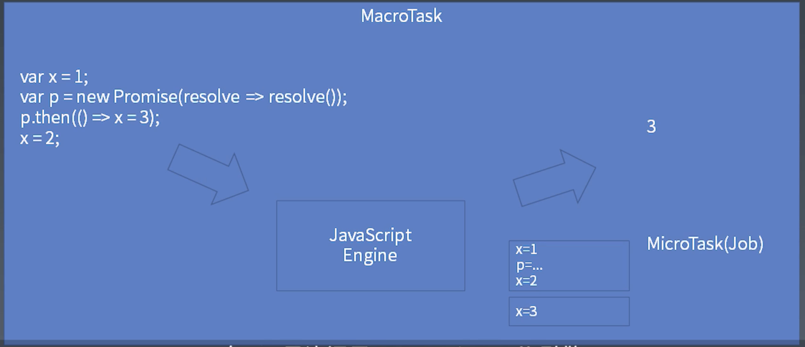
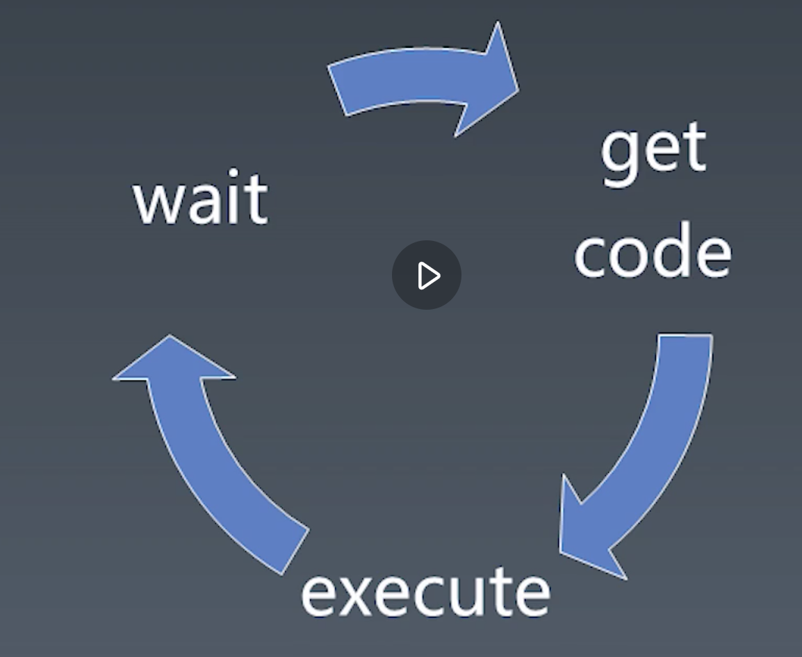

### 二、js执行粒度（运行时）

- 宏任务  macrotask
- 微任务  microtask promise
- 函数执行 execution context
- 语句、声明  completion record
- 表达式 reference
- 直接量 变量 this

#### 宏任务 & 微任务
1. 把代码传给js引擎的过程叫宏任务
2. js引擎执行代码  微任务？

#### 事件循环

1. get code  获得代码
2. execute  执行代码
3. wait  等待
4. 重复第1步


#### 通过面试题目拓展

``` javascript
setTimeout(_ => console.log(4));

new Promise(resolve => {
  resolve();
  console.log(1);
}).then(_ => {
  console.log(3);
})

console.log(2);

// 1 2 3 4

// 再看一个demo
console.log('script start');
setTimeout(()=>{
    console.log('setTimeout');
}, 0);
Promise.resolve().then(
    ()=>{
        console.log('promise-1');
    }
)
Promise.resolve().then(
    ()=>{
        console.log('promise-2');
    }
)
console.log('script end');

// 答案是 
// -> script start 
// -> script end
//->promise-1
//->promise-2
// ->setTimeout

```