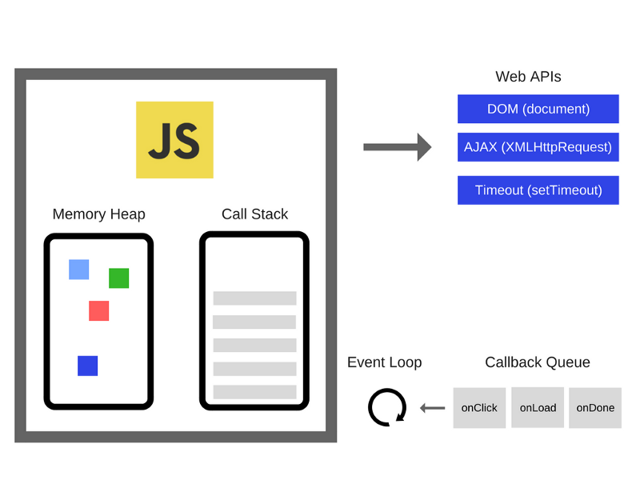

### 二、js执行粒度（运行时）

- 宏任务  macrotask
- 微任务  microtask promise
- 函数执行 execution context
- 语句、声明  completion record
- 表达式 reference
- 直接量 变量 this

#### 宏任务 & 微任务
1. 把代码传给js引擎的过程叫宏任务
2. js引擎执行代码  微任务？

#### 事件循环

1. get code  获得代码
2. execute  执行代码
3. wait  等待
4. 重复第1步

---

#### 详细扩展

> 为了与浏览器进行交互，Javascript是一门非阻塞单线程脚本语言。

- 为什么是单线程？线程安全，避免多线程操作DOM，无法以谁为准。支持多线程，new Worker 但它们不能操作DOM。
- 非阻塞？单线程又不阻塞，这个就引出异步回调机制，再引出事件循环(->_->)

先盗个图(-_-!)



> v8 js引擎
- meory heap(内存堆) 内存分配地址的地方
- call stack(调用栈) 代码执行的地方
    * 先进后进
    * 运行一个函数时，放在栈顶，函数返回时则从栈顶弹出
```javascript
    function one() {
        two();
        console.log('one');
    }
    function two() {
        return 'two';
    }
    one();
```
转换为图例


堆栈追踪
```javascript
    function one() {
        two();
    }
    function two() {
        three();
    }
    function three() {
        throw new Error('new error');
    }
    one();

    //VM96:8 Uncaught Error: new error
    // at three (<anonymous>:8:15)
    // at two (<anonymous>:5:9)
    // at one (<anonymous>:2:9)
    // at <anonymous>:10:5
```
堆栈溢出
```javascript
    function one() {
        one();
    }
    one();
    // 死循环，没有递归出口
```

> Web API 引擎外的api统称
- DOM(document)
- AJAX
- Timeout
- ...
> callback queue
- onClick
- onLoad
- onDone

回调队列包含了一系列待处理的信息与相关联的回调函数。 分为MacroTask Queue 和 MicroTask Queue 两种。
- micro task事件：Promises(浏览器实现的原生Promise)、MutationObserver、process.nextTick

- macro task事件：setTimeout、setInterval、setImmediate、I/O、UI rendering
这里注意：script(整体代码)即一开始在主执行栈中的同步代码本质上也属于macrotask，属于第一个执行的task<br />

执行顺序


如图所示，二者互相穿插：MacroTask --> MicroTask Queue --> MacroTask。
一个Event Loop会有一个或多个 MacroTask Queue，而 Event Loop 仅有一个 MicroTask Queue。

图中有两个microTask, 但第一个microTask queue 跑完才会执行下一个microTask,所以只会存在一个一个循环中只会有一个microTask

> Event Loop 每一次循环称为tick，每一次tick的任务细节如下：
- 调用栈选择最先进入队列的MacroTask（通常是script整体代码），如果有则执行；
- 检查是否存在 MicroTask，如果存在则不停的执行，直至清空 MicroTask Queue；
- 浏览器更新渲染（render），每一次事件循环，浏览器都可能会去更新渲染；
- 重复以上步骤。

---
最后整体理下JavaScript Runtime 的运行机制: 
1. 主线程不断循环；
2. 对于同步任务，创建执行上下文（Execution Context），按顺序进入调用栈；
3. 对于异步任务：
    - 与步骤 2 相同，同步执行这段代码；
    - 将相应的 MacroTask（或 Microtask）添加到任务队列；
    - 由其他线程来执行具体的异步操作。
> 其他线程是指：尽管 JavaScript 是单线程的，但浏览器内核是多线程的，它会将 GUI 渲染、定时器触发、HTTP 请求等工作交给专门的线程来处理。另外，在 Node.js 中，异步操作会优先由 OS 或第三方系统提供的异步接口来执行，然后才由线程池处理。

1. 当主线程执行完当前调用栈中的所有任务，就会去读取 Event Loop 的任务队列，取出并执行任务；
2.  重复以上步骤。

还是拿 setTimeout 举例：
1. 主线程同步执行这个 setTimeout 函数本身。
2. 将负责执行这个 setTimeout 的回调函数的 MacroTask 添加到 MacroTask Queue。
3. 定时器开始工作（实际上是靠 Event Loop 不断循环检查系统时间来判断是否已经到达指定的时间点）。
4. 主线程继续执行其他任务。
当调用栈为空，且定时器触发时，主线程取出 MacroTask 并执行相应的回调函数。

> setTimeout和setInterval取的时间是不准确的，因为当调用栈若不为空，它们的回调函数永远不会别执行。所以，我们会经常碰到setTimeout和setInterval用来做动画的时候，很不流畅或者卡顿。

___

### 面试题来一波（0_0）


``` javascript
setTimeout(_ => console.log(4));

new Promise(resolve => {
  resolve();
  console.log(1);
}).then(_ => {
  console.log(3);
})

console.log(2);

// 1 2 3 4
```
- 先执行同步代码
    - 首先，执行new Promise中的console.log(1)，then后面的属MicroTask所以跳过；
    - 然后，执行console.log(2)。
- 异步代码进入 任务队列
- 执行完script这个MacroTask后，执行MicroTask（也即Promise.then） 中的console.log(3)。
- 后面无其他微任务。执行后一个MacroTask也即定时器setTimeout中的console.log(4)。 
- 最后，有理有据的猜出写出正确答案：1、2、3、4。
``` javascript

// 升级下
console.log('script start');
​
setTimeout(function() {
    console.log('timeout1');
}, 10);
​
new Promise(resolve => {
    console.log('promise1');
    resolve();
    setTimeout(() => console.log('timeout1'), 10);
}).then(function() {
    console.log('then1')
})
​
console.log('script end');


// 答案是 
// -> script start 
// -> script end
//->promise-1
//->then-1
// ->timeout1
// timeout2

Promise.resolve().then(()=>{
    console.log('1')
    setTimeout(()=>{
        console.log('2')
    },0)
})

setTimeout(()=>{
    console.log('3')
    Promise.resolve().then(()=>{
        console.log('4')
    })
},0)

// 同步代码 无输出
// 外层setTimeout 进入任务队伍（宏）
// 第一个同步代码的宏任务执行完 执行其对应的微任务promis.then，先输出console.log(1),其中的setTimeout进入任务队伍（宏）
// 微任务跑完，执行下一个宏任务 cosole.log(3) , 执行promise.then微信任务 console.log(4)
// 执行最后一个宏任务console.log(2)

// 1 3 4 2


```

最后补个表
|宏任务|浏览器|node|
|--|--|--|
|setTimeout|√|√|
|setInterval|√|√|
|setImmediate|x|√|
|requestAnimationFrame|√|x|
|I/O|√|√|

|微任务|浏览器|node|
|--|--|--|
|process.nextTick|x|√|
|MutationObserver|√|x|
|Promise.then catch finally|√|√|

### vue.nextTick实现?