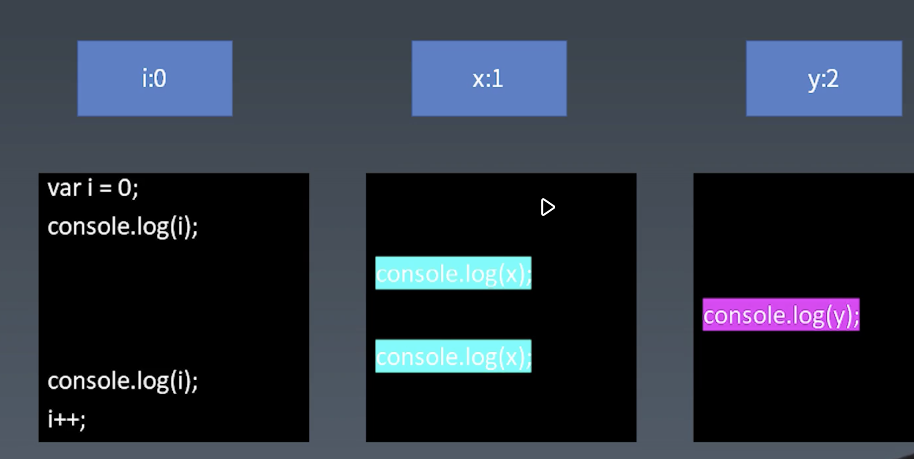
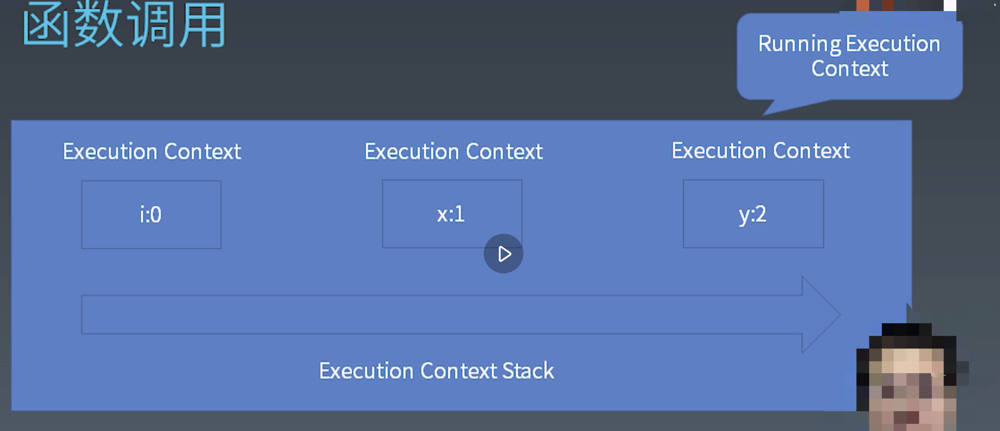
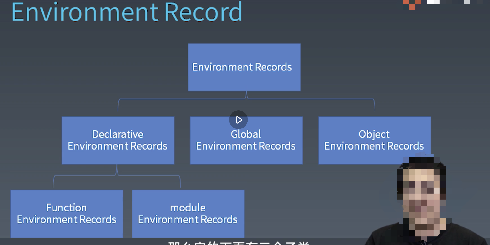
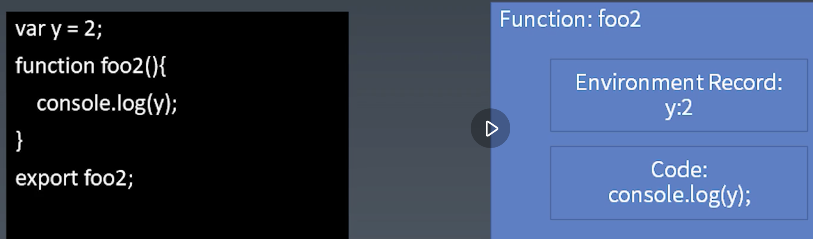

### 函数调用

由一个demo展开

```javascript
// index.js
import {foo} from 'foo.js'
var i = 0;
conosle.log(i);
foo();
console.log(i);
i++;

// foo.js
import {foo2} from 'foo2.js';
var x = 2;
function foo() {
    console.log(x);
    foo2();
    console.log(x);
}
export foo;

// foo2.js
var y = 2;
function foo2() {
    console.log(y);
}
export foo2;

// 相当于
var i = 0;
conosle.log(i);
console.log(x);
console.log(y);
console.log(x);
console.log(i);
i++;

```

我们可以看到，形成了三个栈


- execution context
    - code evalution state
        - async generator 执行到哪的信息
    - function  由 function初始化的 execution context 会有
    - script or module  
    - generator generator背后的generator？
    - realm  所有内置对象的领域 
    - lexical environment
    - variable environment  var变量

__ECMAScript code 是没有generator的__

- lexical environment
    - this
    - new tartget
    - super
    - 变量

- variable environment

历史遗留包袱，只处理var 声明

### environment record


### function closure 闭包

更复杂的情况 scope chair 箭头函数 使用this也保留

### realm

-> 使用的内置对象都放入 realm中
上一节说到的装箱转换，会生成一个对象，realm就是它们的原型

### 尝试找出 JavaScript 引擎里面 Realm 所有的对象，使用一个 JS 数据可视化的框架去做一个可视化