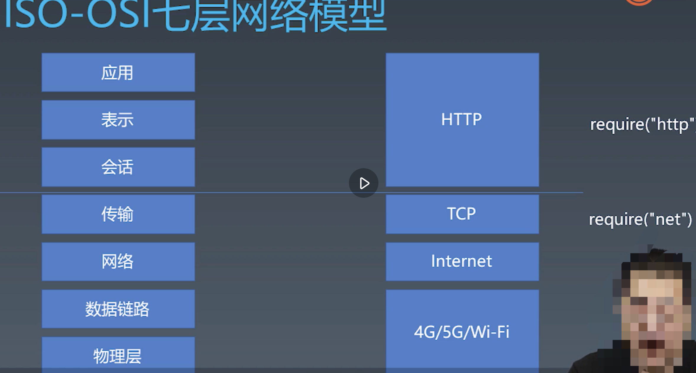
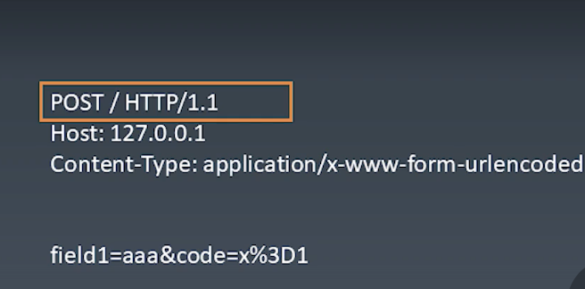
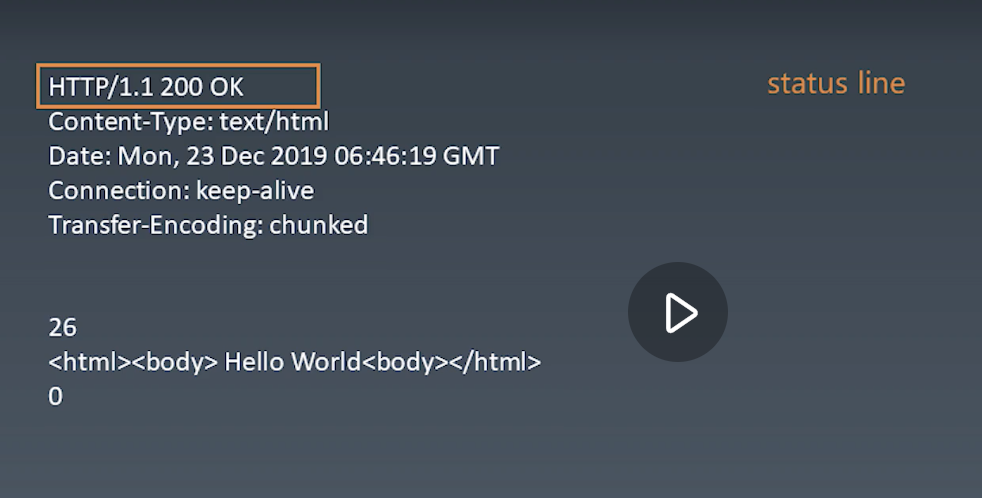

### HTTP协议解析

网络七层模型ISO-OSI七层网络模型
- 物理层 
- 数据链路层  wifi/4g  接入层
- 网络层     internet
- 传输层     TCP
- 会话层
- 表示层
- 应用层    剩下这三个就http解析了

TCP IP 里面的一些概念

- 流(stream)  没有明显的分割单位，只保证前后顺序
- 端口  每个软件应用的标识吧，网卡根据端口号分析数据
- 包(packet)   传输数据包 TCP/IP传输的数据单元
  - 应用层在发送数据的时候，都是站在一个个包的视角，将包一个个发送出去，形成一个 stream，接收端收到 stream 之后，再按照具体的协议切割还原成发送方所发送的包
- IP  连接internet的设备
- require('net')
- libnet（构造IP包并发送）/libcap（去网卡抓流经网卡的IP包）

request  一一对response应的

- 文本协议 都是字符串内容

1. 第一行request line 三部分 method 、path/、http 及其版本
2. headers  冒号分割的 键值对
3. body 格式同content-type 决定
  - chunck body 十六进制数字单独占一行 最后用0结尾
 
send函数总结
- request 构造器收集必要的信息
- 设计send函数，把请求发送到真实服务器
- send应该是异步的，返回promise

response 格式

- status line  协议 版本号  状态码
    - 500 服务器错误 502网关错误 503停机或超负  504 网关超时
    - 401 无权限 403 拒绝访问 404 找不到 405 方法不允许
    - 200 成功 201 已创建  202 已接受
    - 301 永久重定向 302 临时重定向
- header key value 结构 跟request一样
- 空行
- body 格式由cotent-type

发送请求总结 send 
- 支持已有connect 或者新建
- 收到数据传给parser
- 根据parser状态 resolve promise

#### 第四步 response 解析

- response 必须分段构造，我们要用一个responseParser来 装配
- responesParser 分段处理responseText 我们状态机来分析文本结构

#### 第五步 response parser

- response的body可能根据content-type有不同的结构，因此我们会采用parser的结构来解决问题
- 以trunkedBodyParser为例，我们同样用了状态机来处理body的格式

