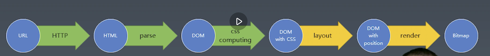
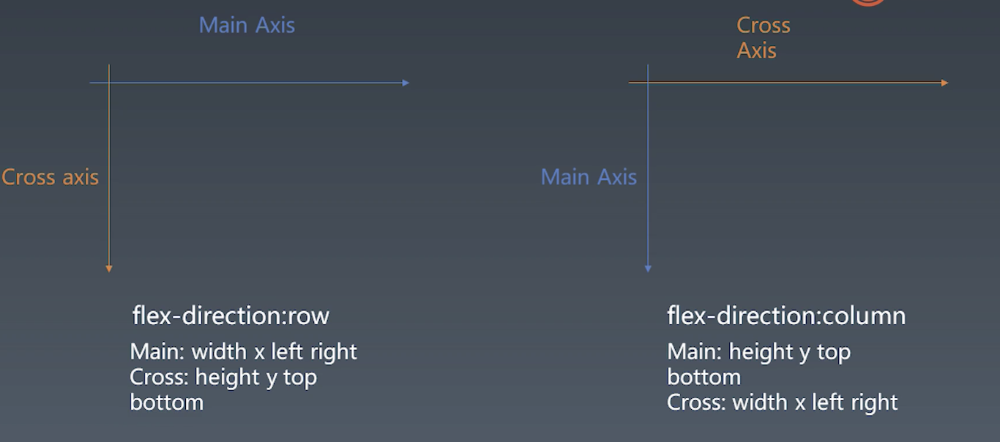
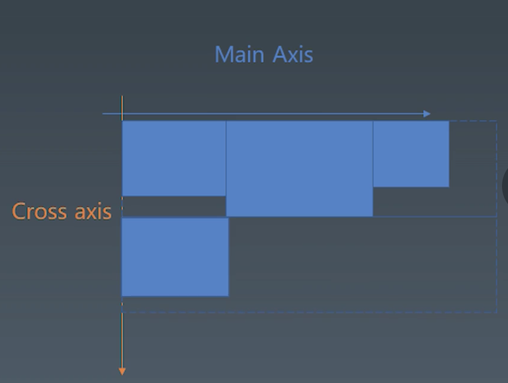
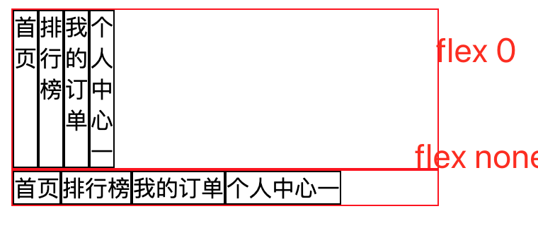
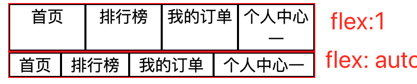

## week-10 浏览器排版



从上一周，我们得到一颗带css样式的dom树。这周就根据它进行排版
layout 直译是布局，意译排版。

[补充第七周的总结，状态机与状态模式](./disign-pattern/state-pattern.md)

***

### 一、排版
四代排版

- position float display
- flex
- grid
- css hodini


这节课使用flex排版，我们需要搞清楚主轴（main axis) 交叉轴（cross axis)的概念。

[先来一波flex相关复习](./flex/note.md)



图中
- flex-direction: row
    - main axis 就是从左往右
    - cross axis 就是从上到下
    - 主轴相关属性就是 width left right  x
    - 交叉轴相关属性  height top bottom  y

- flex-direction: column
    - main axis 就是从上往下
    - cross axis 就是从左往右
    - 主轴相关属性 height top bottom y
    - 交叉轴      width  left right x

----
#### 代码逻辑
- layout触发时机，endTag之前
- 拆分文件 require
- 样式预处理下，把数值字符串转number类型
- 先根据 flex-item order 排序
- 设置默认值
- 处理flex-drection 四个值的情况
- 再处理下flex-wrap: wrap-reverse交叉轴的情况

### 二、收集元素进 行（row）

- 根据主轴尺寸，把元素分行
- 假如设置no-wrap 则强行分配进第一行



**void 0 来代替undefined  全局需要不能undefined，但局部还是可以作为变量名**


#### 代码逻辑

- mainSpace 是第主轴的剩下的空间，下节分配
- crossSpace 交叉轴的行高
- 如果没有nowrap属性 item的mainSize大于mainSpace, 这个时候就要换行了
- 把mainSpace、crossSpace记录起来，创建新的行
- 这里被绕了一下，因为先定义了 flexLines = [flexLine]; 
```javascript
let flexLine = [];
// 忽略了这里，常规思维是第一行满了再push进去。由于一有伸缩，不换行的属性，直接把第一个放进去了
let flexLines = [flexLine];
// ....
// 换行
flexLine.mainSpace = mainSpace;
flexLine.crossSpace = crossSpace;

// 新一行的数据
flexLines.push(flexLine);
flexLine = [item];
mainSpace = style[mainSize];
crossSpace = 0;

```

### 三、计算主轴

这个先来学习下item的flex属性
- flex: 0(0 0 0%) && flex: none(0 0 auto)


- flex:1 (1 1 0%) && flex: auto(1 1 auto)
    这里 只有flex-basis的不同


有意思？一一计算分析
**当flex-basis属性值为0，在width有申明的情况下以width来计，width没有的申明的话，则按其内容来计。**
- flex: 0 相当 flex-grow 0  flex-shrink 0 flex-basis 0%
    - 主轴宽度为300 flex-basis 0%可分配的空间也是400
    - flex-grow 0  flex-shrink 0 子项没有分配到空间
    - 也没有声明宽度，表现为最小内容宽度
- flex: none 相当 flex-grow 0  flex-shrink 0 flex-basis auto
    - 主轴宽度为300 flex-basis auto 也没有设置到width 所以cotent内容来算
    - flex-grow 0  flex-shrink 0 子项没有分配到空间
    - 也没有声明宽度，表现为内容宽度

- flex: 1 相当 flex-grow 1  flex-shrink 1 flex-basis 0%
    - 表现效果 平均分配
    - flex-basis 0% 剩余空间即是300  
    - flex-grow 1 所以平均分配
- flex: auto 相当 flex-grow 1  flex-shrink 1 flex-basis auto
    - 表现效果 原有content内空宽度上，分配相同的空间
    - flex-basis auto 剩余空间为300-各个item的内容宽度  
    - flex-grow 1 所以平均分配剩余空间

[大神总结1](https://blog.csdn.net/u010377383/article/details/79661859)

[大神总结2](https://blog.csdn.net/lu92649264/article/details/111028931)

#### 代码逻辑

- 判断剩余空间，如果小于零，肯定是没换行，只有一行
    - 每个元素按照收缩比例进行缩小
- 多行的时候，剩余空间大于零
    - 如果有设flex 按flex/flexTotal 进行分配
    - 如果没有话，按justifycontent的属性进行 start end的位置


### 四、计算交叉轴

主要是要处理 align-content align-items及项目的align-self

代码逻辑
- 判断是否有交叉轴“高度”
    - 无则，每行累加，没有剩余空间
    - 有, 则遍历减得剩余空间
- 判断是否为wrap-reverse
    - 是的话 crossBase = crossSize
    - 否  crossBase = 0
- 判断align-content 属性
    - 计算 crossBase / step

- 循环每一“行” 处理其align-items align-self属性
    - 每一行每一个item的crossStart crossEnd


### 五、渲染单个元素

为了简化过程，node环境下使用images库将dom元素绘制到图片，这样可以避免安装大量的C++

.fill(red, green, blue[, alpha])
eg:images(200, 100).fill(0xff, 0x00, 0x00, 0.5) Fill image with color
以指定颜色填充图像


### 五、渲染dom树

递归调用render


### 最后再贴个流程图吧


- 输入url http response返回
- parser response 形成dom树
- 收集css 计算优先级 再把样式挂在dom树上
- layout 布局 计算每个元素的位置
- render 渲染，使用images 递归绘制每个元素的位置及其背影色


