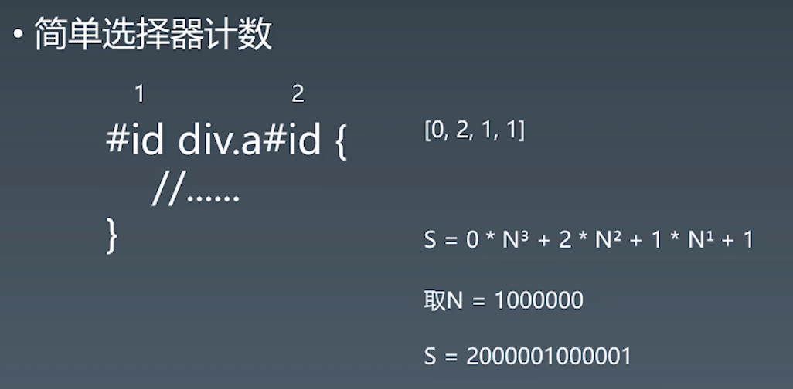
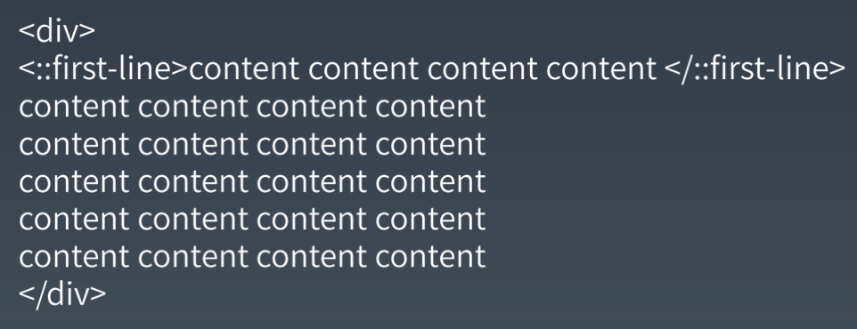
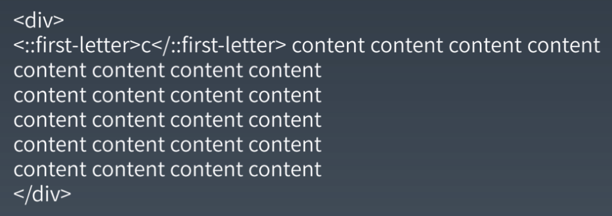
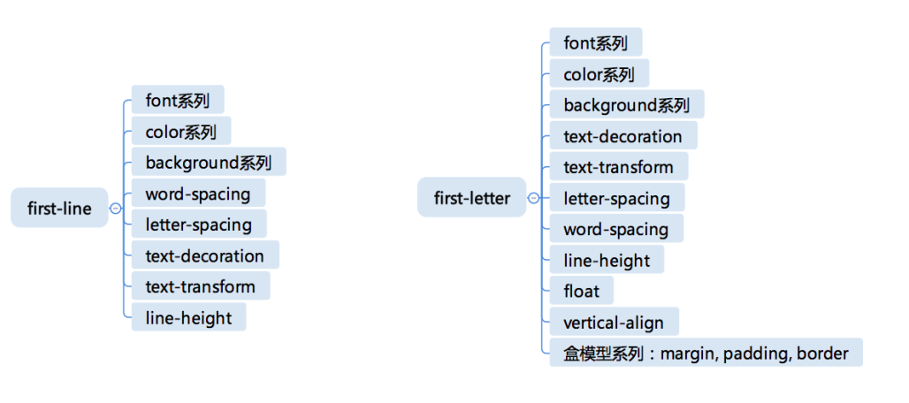

### 选择器
--- 
#### 一、语法
- 简单选择器 simple selector   -- 最小单位
    -  \* 能用选择器
    - div svg|a 标签选择器
        - namespace ->HTML/SVG/MathML
    - .class
    - #id
    - [attr=value] 精确匹配
        - [attr|=value] 属性中必须是完整且唯一的单词，或者以 - 分隔开
        - [attr~=value] 含独立的单词为 value
        - *=
        > [title*=flower]   -->  \
        - ^= 开头
        - $= 结束
    - :hove 伪类
    - ::before

- 复合选择器  compound selector    -- 倒数第二
    - <简单选择器><简单选择器><简单选择器>，匹配同一元素上，与的关系。
    - \*或者div， 必须写在最前面 例如#iddiv就会产生歧义
    - 伪类伪元素一定要写在最后面
- 复杂选择器  连接符 连接 复合选择器而成   -- 倒数第三
    - <复合选择器>\<sp><复合选择器>：就是「后代选择器」，可以匹配子子孙孙的元素
    - <复合选择器>">"<复合选择器>：就是「儿子选择器」，只会匹配直接子元素
    - <复合选择器>"~"<复合选择器>：就是「通用兄弟选择器」，可以匹配任何同级元素，位置无需紧挨着。
    - <复合选择器>"+"<复合选择器>：就是「相邻兄弟选择器」，只会匹配两个元素紧挨着的情况，并且两个元素属于同一个父元素。

- selectors_group  逗号 空格 星号  顶级

#### 二、优先级 priority

specificity  具体的程度的意思，有「这个词语的含义越模糊表示优先级越低」的意思在里面。



第一位 inline
第二位 id
第三位 class 属性选择器  [attr=value] 、伪类
第四位 type、伪元素 

特例
- :is()、:not() 和 :has()  的优先级，要根据它们的参数「选择器列表」或者「复杂选择器」进行计算。
- :nth-child() 和 :nth-last-child()  的优先级，会用它们本身的 「伪类选择器」的优先级（也就是统计到 第三位），然后再加上它们的参数「选择器列表」或者「复杂选择器」的优先级。
- :where() 的优先级是 0，并且它的参数也不参与优先级计算。
- 通配选择符（universal selector）（*）关系选择符（combinators）（+, >, ~, ' ', ||）和 否定伪类（negation pseudo-class）（:not()）对优先级没有影响
- 最后还有一个特例，就是带 !important 的规则，但是这个不参与优先级运算，直接覆盖没有 !important 的规则，当两条相互冲突的带有 !important 规则的声明被应用到相同的元素上时，拥有更大优先级的声明将会被采用。

> 一定不要在工程项目中使用 !important。
N取值越大越精确，但消耗运算内存


练习题
 1. div#a.b .c[id=x] 0 1 3 1 
 2. #a:not(#b)       0 2 0 0 
 3. *.a              0 0 1 0 
 4. div.a            0 0 1 1


#### 三、伪类 ： pseudo

- 链接、行为
    - :any-link
    - :link + :visited = :any-link
    - :hover
    - :active
    - :focus 选择获得焦点的输入字段，并设置其样式
    - :target 突出显示活动的 HTML 锚

- 树结构
    - :empty  没有子元素的元素
    - :nth-child()  even odd 3n+1 3n+2之类的计算
    - :nth-last-child()
    - :first-child :last-child() :only-child(唯一一个元素)

    - nth-of-type 一套

    nth-child 与nth-fo-type区别

    nth-child(n)是匹配父元素中的第 n 个子元素
    nth-fo-type是匹配同类型中的第n个同级兄弟元素
- 逻辑伪类
    - not() 用来匹配不符合一组选择器的元素。由于它的作用是防止特定的元素被选中，它也被称为反选伪类（negation pseudo-class）。
    - :not(x) 的参数，在 Selector Level 3 中只支持「复合选择器」，当然不包含 :not 本身。在 Selector Level 4 中 not 允许接受一个「选择器列表」，这意味着选择器支持嵌套，仅靠 not 即可完成选择器的一阶真值逻辑完备，但目前还没有看到浏览器实现它。
    - :is()（CSS4）将「选择器列表」作为参数，并选择该列表中任意一个选择器可以选择的元素。
    - :where()（CSS4）函数接受「选择器列表」作为它的参数，将会选择所有能被该选择器列表中任何一条规则选中的元素。
    - 与 is 的区别是 where 的「优先级」总是 0（不会参与优先级计算），但是 is 内的选择器会参与优先级计算。
    - :has()（CSS4）代表一个元素，其给定的选择器参数至少匹配一个元素。

>  css4 产生式结构
• selector list（选择器列表）
    • complex selector（复杂选择器）
    • compound selector（复合选择器）
    • simple selector（简单选择器）

#### 三、伪元素 ： pseudo

 - ::before 之前
 - ::after  之后
 - ::first-line 第一行
 - ::first-letter 第一个字母

 两种机制
 1. 无中生有 before after
 
 2. 括起来  first-line first-letter
  

  可用属性

  

>思考题 1：为什么 ::first-letter 可以设置 float 之类的，而 ::first-line 不行呢？

因为 float 会让元素脱离文档流，然后文档流内的内容会选出新的第一行，这个新的第一行又会被 ::first-line 选中，然后 float 使其脱离文档流。最后会一直循环下去，知道文档流没有文字。

> 思考题 2：为什么 ::first-line 可以改变字体的大小、间距等等属性？

其实这个问题涉及到了 ::first-line 的本质。::first-line 其实不是先算好哪些文字在第一行，而是在排版的过程中将 :first-line 中的属性直接加到文字上，直到第一行被排满了，后面的文字都撤销掉 :first-line 应用的属性。

>作业： 编写一个 match 函数。它接收两个参数，第一个参数是一个选择器字符串性质，第二个是一个 HTML 元素。这个元素你可以认为它一定会在一棵 DOM 树里面。通过选择器和 DOM 元素来判断，当前的元素是否能够匹配到我们的选择器。（不能使用任何内置的浏览器的函数，仅通过 DOM 的 parent 和 children 这些 API，来判断一个元素是否能够跟一个选择器相匹配。）以下是一个调用的例子。

```javascript
function match(selector, element) {
    return true;
}
match("div #id.class", document.getElementById("id"));

// 匹配用空格连接的后代复杂选择器，不考虑 + ~ > ||
// 暂不考虑伪类伪元素 类型太多了，还要处理其函数表达式

let domList = [];

function match(selector, element) {
    // 使用空格拆分 从右到左解析
    let selectors = selector.split(' ').reverse();
    let parsedSelectors = [];

    // 循环判断是否为type class id
}

代码逻辑，只处理空格分割的后代选择器  <复合选择器>\<sp>\<复合选择器>
不处理伪类伪元素

1. 通过空格分割选择器 并反转reverse，从右到左选择原则
2. 处理复合选择器 使用正则匹配/(\w+)|(\.\w+)|(\#\w+)/g
3. 开始匹配 节点的className id tagName是否相等
4. 第一级匹配成功后 就要匹配父级
```
[demo](./match.html)

