layout学习笔记

---
### 一、盒box
| 源代码 | 语义 | 表现 |
| -- | -- | -- |
| 标签 | 元素 | 盒 |
| Tag | Element | Box |

**开场练习**

- HTML代码中可以书写开始__标签__，结束_标签___ ，和自封闭_标签___ 。

- 一对起止_标签___ ，表示一个__元素__ 。

- DOM树中存储的是_元素___和其它类型的节点（Node）。

- CSS选择器选中的__元素__ ，在排版时可能产生多个__盒__ 。

- 排版和渲染的基本单位是__盒__ 。

**盒模模型**

由四层组成
- content
- padding
- border
- margin
盒模型由box-sizing控制，
- 默认值为content-box 盒子宽度即为content的width
- border-box  宽度为 content + padding + border 的宽度
如下图：
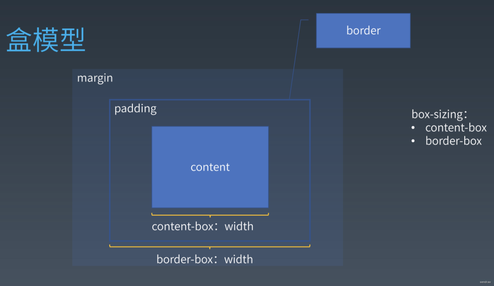

### 二、正常流 normal flow

浏览器排版大概分三代

- 正常流normal display block inline inline-block /  float /position absolute relative / clear /
- flex   display flex
- grid   display grid
- css houdini   3.5代

为什么layout翻译成排版，而不是布局

模拟印刷行业，一个个字的放成盒子里面排版

margin 其实可以翻译成留白，因为它往往是表示图片、表格等周围的留白
padding 页边距

都是文字出版行业的专家出来做的

开始我来思路一个问题，我们是如何写字的
- 从左到右写
- 同一行的字是对齐的
- 写满一行就要换下一行

回顾下flex 排版
- 收集元素进“行”
- 计算主轴
- 计算交叉轴

normal flow 排

- 收集盒和文字进 行
- 计算盒和文字在行中的排布
- 计算行 与 行之间的排布

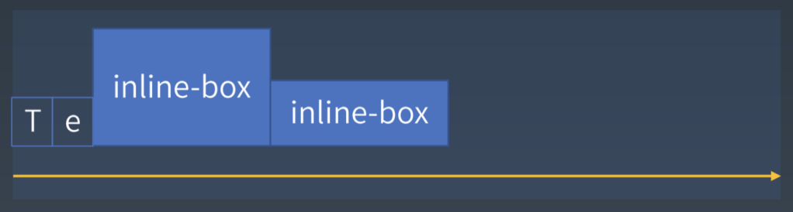
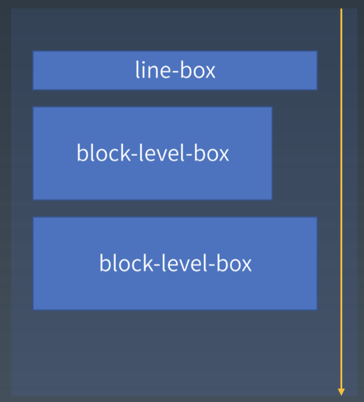

先了解一些概念的东西（不考虑write-mode)
- block level box 块级盒
- inline level box 行内级盒
- line box  = 文字 + inline level box
- block level formatting context（BFC 块级格式化上下文） 块级垂直排  
- inline level formatting context（IFC 行内级格式化上下文）」行内级从左到右。

**bfc 面试常考的东西，应该叫设立bfc 而不是触发bfc**

### 三、正常流 行级排布

**baseline**

英语中四谱线中的第三条线就是基线，每个字母都按个这基线对齐。
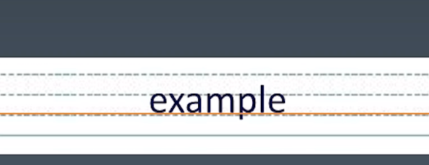
中文为方块字 以文字的上缘和下缘做为基线

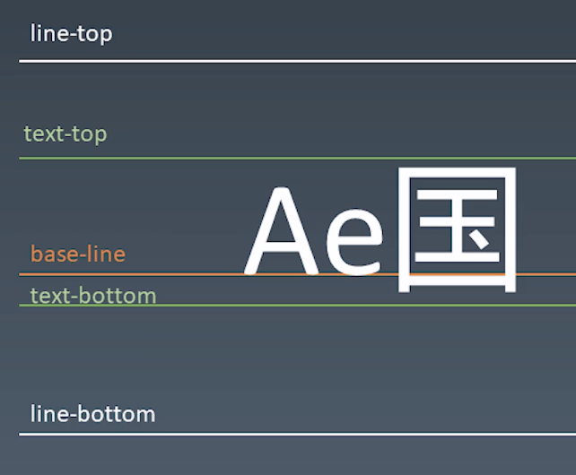

line-top ~ line-bottom 行高
text-top text-bottom 取最大的字体

如果文字跟box混排，就会发生line-top line-bottom偏移的问题

vertical-aline 垂直对齐
- baseline：将行内盒的基线与父元素（一般是行盒）的基线对齐。如果行内盒没有基线，则将底边距边缘与父元素（一般是行盒）的基线对齐。
- middle：将行内和的垂直中点与父元素（一般是行盒）的基线加上 x 字符高度 的一半对齐。
- sub：将行内盒的基线与父元素的下沿对齐。(该值对元素文本的字体大小没有影响)
- super：将行内盒的基线与父元素的上沿对齐。(该值对元素文本的字体大小没有影响)
- text-top：将行内盒的顶部与父元素内容区域的顶部对齐。
- text-bottom：将框的底部与父元素的内容区域的底部对齐。
- <percentage>：使元素的基线对齐到父元素的基线之上的给定百分比，该百分比是 - line-height 属性的百分比。可以是负数。
- <length>：使元素的基线对齐到父元素的基线之上的给定长度。可以是负数。
- top：使元素及其后代元素的顶部与行盒的顶部对齐。
- bottom：使元素及其后代元素的顶部与行盒的底部对齐。

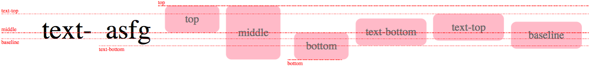

平时使用高度等于行高，设置垂直居中？
首先理解下行高，文字text-top到line-top跟text-bottom到line-bottom的间隔是相等的。
> 对于 vertical-align 尽量只用 top、bottom、middle 这三个

### 四、正常流 块级排布


在 CSS2.1 的介绍 https://www.w3.org/TR/CSS21/visuren.html#positioning-scheme
**float 与 clear**

float 会让元素脱离文档流，占居原来文本的空间，都设置了float的元素不会重叠
手动黑人问号表情？？？脱离文档流，就原来的空间被文本占据，div则渲染到最右边。
脱离来原来的line-box


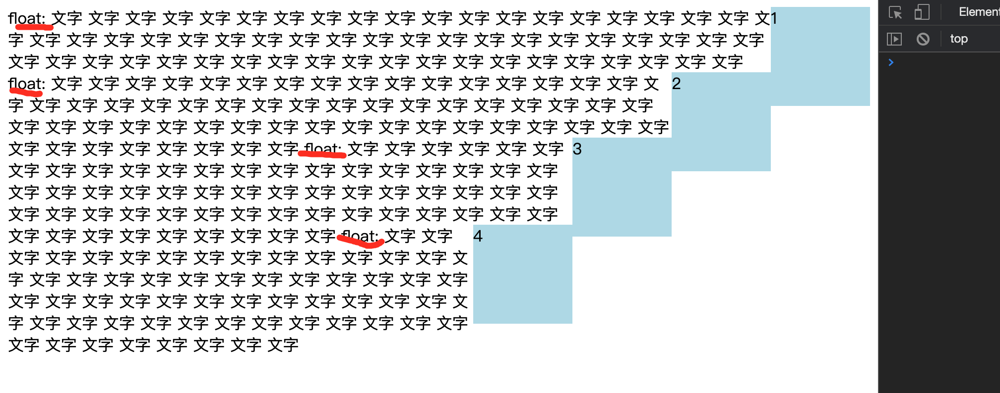

clear 清除浮动不太准确，可以理解为另起一行，从一个“干净”的地方开始。
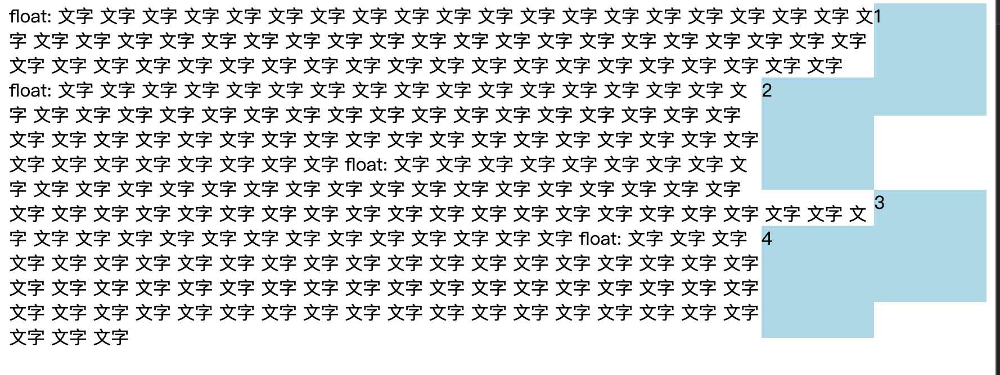

元素全部浮动后，高度塌陷问题 手动黑人问号表情？？？
- 添加一个子元素 clear: both;
- 父级元素添加overflow:hidden 设立bfc
```html
<div style="background-color:pink; overflow: hidden">
    <div style="width: 100px;height: 100px; background-color: blue;border: 1px solid;float: left;"></div>
    <div style="width: 100px;height: 100px; background-color: blue;border: 1px solid;float: left;"></div>
    <div style="width: 100px;height: 100px; background-color: blue;border: 1px solid;float: left;"></div>
    <div style="width: 100px;height: 100px; background-color: blue;border: 1px solid;float: left;"></div>
    <!-- 为什么加上这个，父级元素就撑开 -->
    <div style="clear: both;"></div>
</div>
```

使用float 布局，但现在有flex，比较少用了，其实就是上面的例子
float left 引起重排

**margin折叠？  margin collapse**

在传统印刷行业中，margin就是周围留白的意思，两个盒子之间的取最大的间隔是很自然的事情。
```html
<div style="background-color: lightgreen">
    <div style="width: 100px;height: 100px;background-color: aquamarine;margin: 20px;"></div>
    <div style="width: 100px;height: 100px;background-color: red;margin: 30px 20px;"></div>
    <div style="width: 100px;height: 100px;background-color: aquamarine;margin: 20px;"></div>
    <div style="width: 100px;height: 100px;background-color: aquamarine;margin: 20px;"></div>
    <div style="width: 100px;height: 100px;background-color: aquamarine;margin: 20px;"></div>
</div>
```
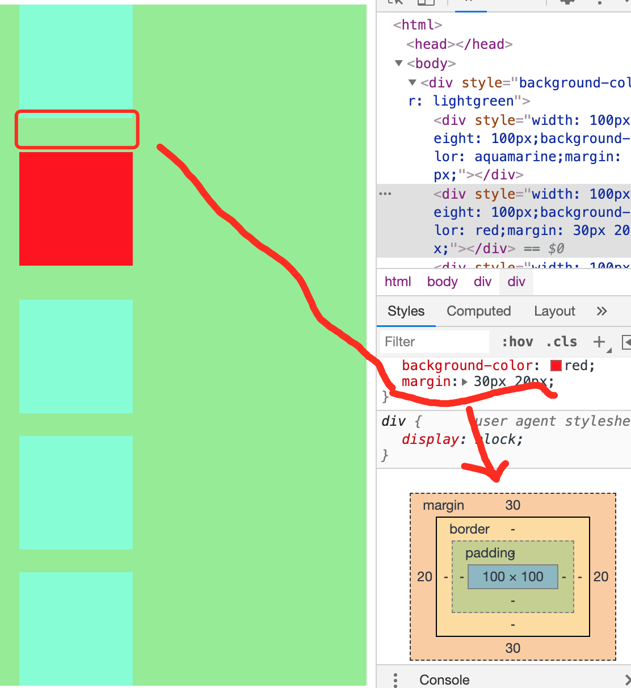


上面的盒子，还看到一个问题，第一个和最后子元素的margin 穿透问题（子元素的margin值作用在父元素上）
- 解决方法 加上overflow: hidden
- 加border

margin collapse 只会发生在 BFC 里面，并且只发生在垂直方向(块级元素本来就是占居一行)
 1. 相邻元素之间
 2. 父元素与其第一个或最后一个子元素之间


 对于面试中的BFC问题，一般是混合了float position

### 五、BFC合并

先学习几个概念

- block container  里面有bfc的  里面可能有bfc line-box
    - 能容纳正常流的盒子，想想有哪些
    - block
    - inline-block
    - table cell
    - table-caption
    - flex item
    - grid-cell
- block level box  外面有bfc的 反之就是可以放进 bfc 里面的东西
    - block
    - flex
    - table
    - grid    
- block box  block-level + block-container 里外都有bfc的

**设立bfc**

- float
- position absolute fixed
- block containers（比如，inline-block、table-cell、table-caption 等等）并且不能是一个 block boxes
- overflow 属性的值不为 visible 的 block boxes

> 所有能容纳正常流的元素都能产生新的 BFC。还有一种特例 overflow 属性为 visible 的 block box，它会与外层的 BFC 发生合并，不会产生自己的 BFC。


block box && overflow:visible
- bfc 合并与float
- bfc 合并与折叠

float 混合demo
```html
<div style="height:500px;background-color: lightgreen">
    <div style="float:right;width: 100px;height: 100px;background-color: aquamarine;margin: 20px;">1</div>
    <div style="overflow:hidden;background-color: pink;">
        <div style="width:100px;height: 100px;background-color: blue;margin: 20px"></div>
        文字 文字 文字 文字 文字
        文字 文字 文字 文字 文字
        文字 文字 文字 文字 文字
        文字 文字 文字 文字 文字
        文字 文字 文字 文字 文字
        文字 文字 文字 文字 文字
    </div>
</div>
```

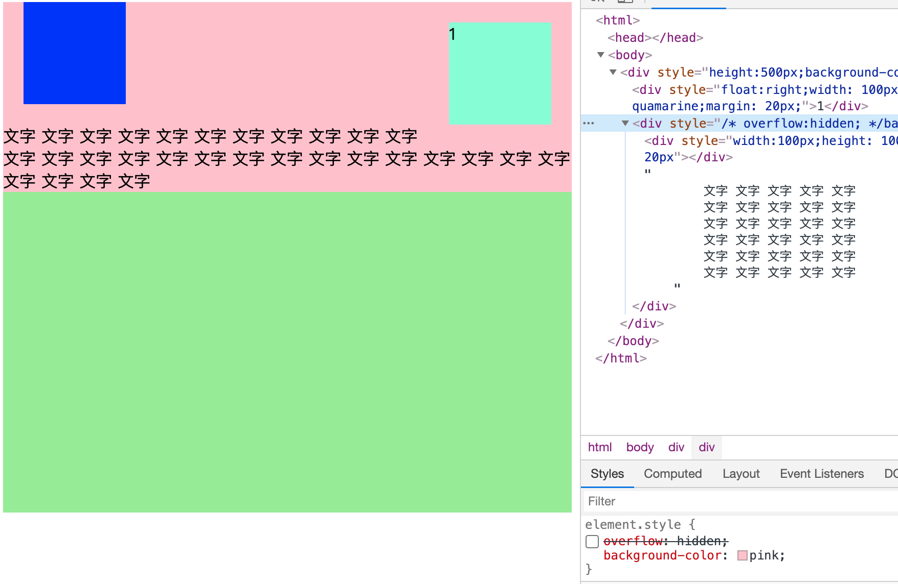
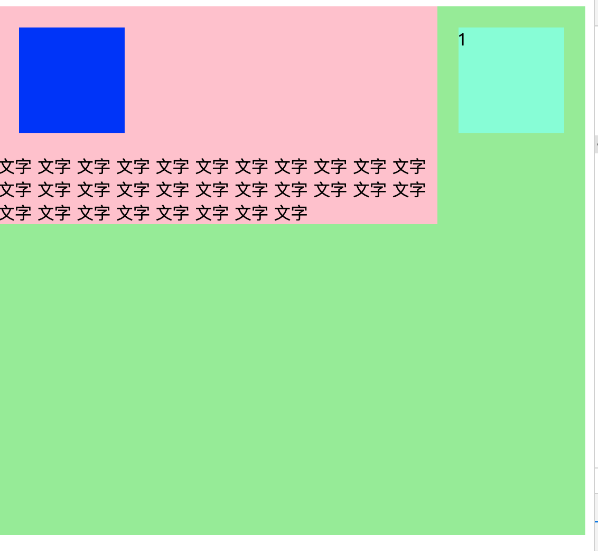

这两个图的区别，就是粉色元素的overflow

非visible时，创建bfc，不会再围绕包含着浮动元素。

### 六、 flex 排版

- 收集 “盒”进 行
- 计算 盒 在主轴方向的排布
- 计算 盒 在交叉轴方向上的排布

不在写元素了
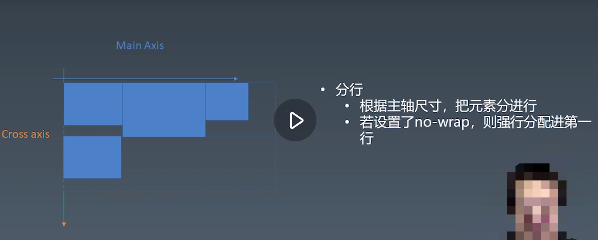
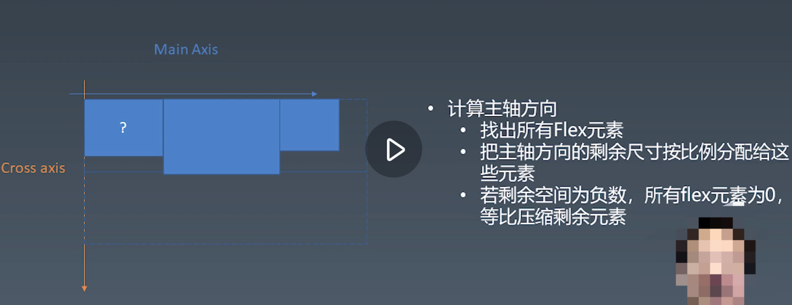
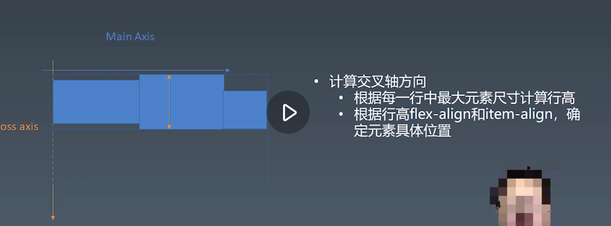

flex-align 和 item-align ?

应该是align-items 或者自身的align-self
