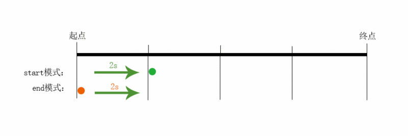

interactive 学习笔记

css 动画相关的属性有 animation transition

### animation

动画属性就是先介绍@keyframes 关键帧

> 插播小知识 显示器的刷新频率一般 60Hz  以上 （也就是 1s 刷新 60 次），人眼就感受不到画面闪动，觉得是完全平滑的。  17ms（1000ms / 60） 一次， 类似一些setInterval 操作，设置0 17 到肉眼来说，是一样的
```css
@keyframes hello {
    from {background: red;}
    to {background: yellow;}
}
/*  0% 和 100% 还可以分别用 form 和 to 来表示的。 */
@keyframes hello {
    0% {background: red;}
    100% {background: yellow;}
}
/* 还可以任意分段 */
@keyframes hello {
    0% {background: red;}
    10% {background: green;}
    20% {background: blue;}
    100% {background: yellow;}
}
```


再来看看animation全家成员
- animation-name  keyframs 名称
- animation-duration  持续时间   
- animation-timimg-function 时间曲线   ease  | ease-in | ease-out | ...
- animation-delay 延时多久开始    负值代表跳过时间
- animation-interation-count 循环次数  n|infinite
- animation-direction   动画方向  alternate

```css
.test {
    animation: hello 2s ease 2s infinite reverse
}
@keyframes hello {
    from {background: red;}
    to {background: yellow;}
}
/*  0% 和 100% 还可以分别用 form 和 to 来表示的。 */
@keyframes hello {
    0% {background: red;}
    100% {background: yellow;}
}
/* 还可以任意分段 */
@keyframes hello {
    0% {background: red;}
    10% {background: green;}
    20% {background: blue;}
    100% {background: yellow;}
}
```


> 插播小知识 补间动画？ 逐帧动画？ 
animation-timing-function: steps(n,start/end) 第一个参数 number 为指定的间隔数，即把动画分为 n 步阶段性展示，第二个参数默认为 end，设置最后一步的状态，start 为结束时的状态，end 为开始时的状态。

end：保留当前帧状态，直到这段动画时间结束
start：保留下一帧状态，直到这段动画时间结束


补间动画，假设我们只定义了from  和 to 的background的颜色，其过程中每一帧的动画就要自动计算出来
逐帧动画，就是设置了steps，中间有多少帧

[网络上的一些demo](https://designmodo.com/demo/stepscss/index.html)


### transition

- transition-property  变换的属性
- transition-duration  
- transition-timing-function
- transition-delay


### cubic-bezier

transition 和 animation 都有timing-function这个属性。也就是动画的时间曲线

- ease  经过时间验证的，最自然的运动曲线
- ease-in 先缓慢，再快速移动  适合退场动画
- ease-out 先快 后慢   适合入场动画
- ease-in-out  上面合起来的效果
- linear  直线
- steps
- cubic-bezier 自定义 https://cubic-bezier.com/#.17,.67,.83,.67

> 没什么特殊要求ease就够用

一次贝塞尔  两点之间


二次贝塞尔
两点之间 加入一个控制点


三次贝塞尔
两点之间 加入两个控制点


