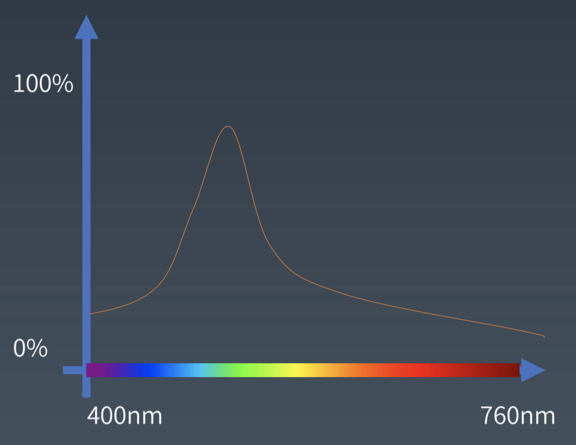
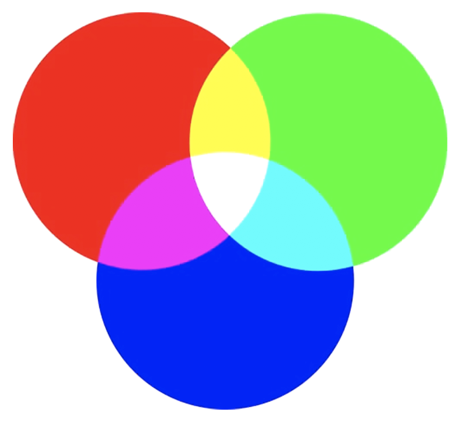
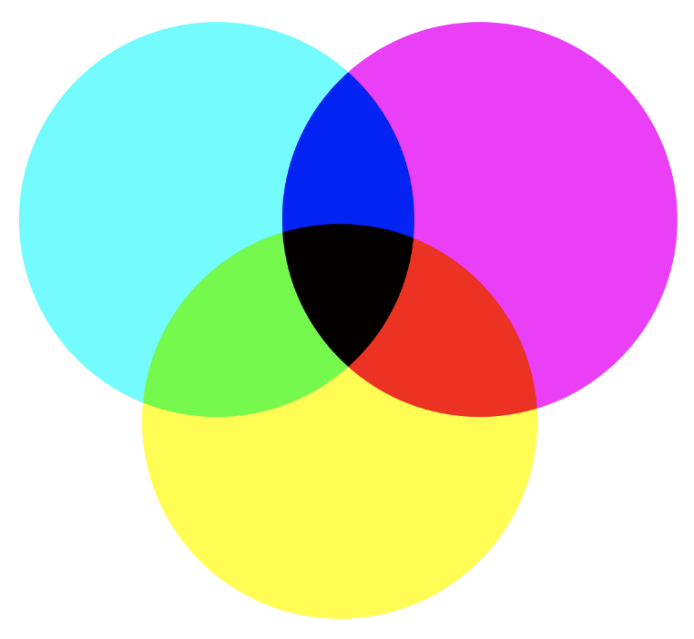
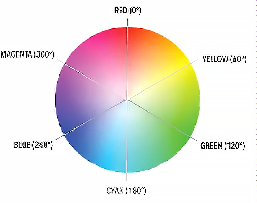
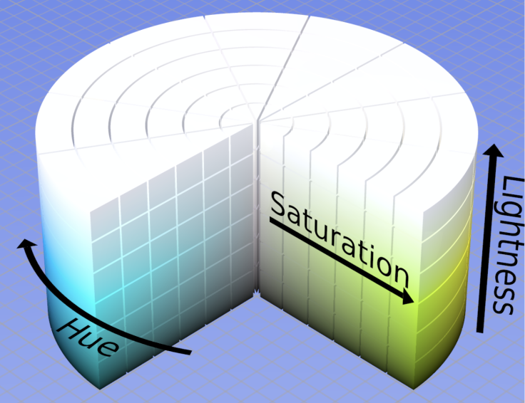

### 一、颜色

日常使用CSS 使用十六进制或者RBG设置 color: #00000  rgb(255,255,255)

对于我们来说颜色是一个个具体的值，但实际光，是按照不同的波光展示出不同的颜色的

一般人眼能分辨的波长是200nm到760nm
我们能看到的红绿蓝 都是混合光，人眼的视觉神经对混合光的识别的结果

#### RGB  red green blue

红 绿 蓝 三原色，计算机最常用的颜色表示法。通过不同比例调出不同的颜色
0 0   0   黑色
255 255 255 白色

#### CMY  cyan 青  magenta 品红  yello 黄

rgb 是自然光的分类，而颜料是吸收了别，反射出来的颜色，所以cmy是rgb的补色

一般简称 红（magenata）黄蓝（cyan 青）三原色

CMYK又是啥东西 Cyan（青色）、Magenta（洋红色，也叫品红色）、Yellow（黄色）、Black（黑色）（这里用 K 是因为 B 的简写已经被 RGB 中的 Blue 占用了）的简称。

在印刷行业，彩色颜料贵，不使用 三原色调成黑色 ，所引用黑色。优先使用黑色调色，最大程度节约成本。

#### HSL HSV

因为rgb不够直观的表示颜色 比如rgb(255 0 0)是红色，人们只能记的。所以就产生了

- H(色相) hub 0-360
- S (纯度 饱和度) saturation 0 100%  指越大纯度越高，越低则逐渐变灰
- L (亮度) 0 100% 0% 没有亮度表示黑色，100% 亮度太高则会变成白色。

**HSV**

value 跟 L 不同，只有亮度的一半，从黑色到选择的色相
但他的S是从白色到饱和的
 

> CSS3 中，只支持 HSL 的颜色表示方式，如，background-color: hsl(0, 100%, 50%) 这个就是红色。

> 如果项目需要做换主题色风格操作，建议使用hsl,直接更换hub，其明暗，及鲜艳状态得而保留。

#### 其它颜色

rgba   alpha 透明度
css 里面还内置一百多种颜色 表达 white red yellow gold 等等

background-image 的
线性渐变
linear-gradient(direction, color-stop1, color-stop2, ..)
放射渐变
radial-gradient(shape size at position, start-color, ..., last-color);
### 二、 形状

很多人，很喜欢使用border box-shadow border-radius来做一些图形，三角形 五角星等等，但不建议使用。
要语义化 border就负责边框的事
阴影就做阴影 圆角就做圆角

专业的方式是使用data uri + svg。
> data uri 数据的表示方式的一种
作业： 在 CSS 脑图上对 CSS 的属性进行分类 ？
