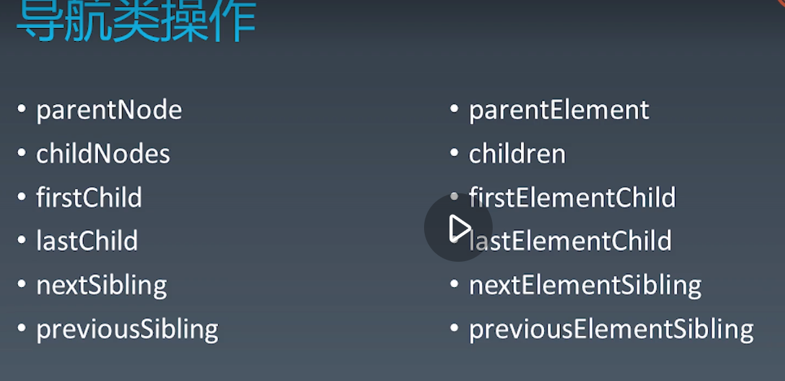

### 一、DOM document objent model   文档对象模型

顾名思义，文档对象模型是用来描述文档，这里的文档，是特指 HTML 文档（也用于 XML 文档，但是本课不讨论 XML）。同时它又是一个“对象模型”，这意味着它使用的是对象这样的概念来描述 HTML 文档。

分为四部分

- node 树形结构节点相关api
- range  操作文字相关api
- 事件  触发与监听相关api
- 遍历  遍历dom相关api

### 二、节点 node

--- 
导航类api

node: 
- parentNode
- childNodes
- firstChild
- lastChild
- nextSibling
- previousSiblig

element
- parentElement
- children
- firstElementChild
- lastElementChild
- nextElementSibling
- previousElementSibling

如果使用node的导航，会出现很多空白 、换行、等文本节点，不能很直观地定位导航，所以平时很少用node的导航节点。这里的parentNode 跟 parentElement 是指向同一节点

---

操作修改类api(在父元素上操作)

- appendChild
- insertBefore
- removeChild
- replaceChild

---

高级api

- compareDocumentPostion 比较两个节点的关系
- contains          检查一个节点是否包含另一个节点
- isEqualNode   检查两个节点是否相同
- isSameNode    检查节点是否为同一个节点  ===
- cloneNode 复制一个节点，如果传入参数true 深拷贝，否则，它只复制当前节点。

---
创建节点

DOM 标准规定了节点必须从文档的 create 方法创建出来，不能够使用原生的 JavaScript 的 new 运算

- createElement
- createTextNode
- createCDATASection
- createComment
- createProcessingInstruction
- createDocumentFragment
- createDocumentTyle

---

操作属性 把属性当作字符串看待

- getAttribute
- setAttribute
- removeAttribute
- hasAttribute

- getAttributeNode
- setAttributeNode

document.body.attributes.class = “a” 
等效于 document.body.setAttribute(“class”, “a”)

--- 

查找元素

- querySelector
- querySelectorAll
- getElementById
- getElementByName
- getElementByTabName
- getElementByClassName

getElementsByName、getElementsByTagName、getElementsByClassName 获取的集合并非数组，而是一个能够动态更新的集合。
