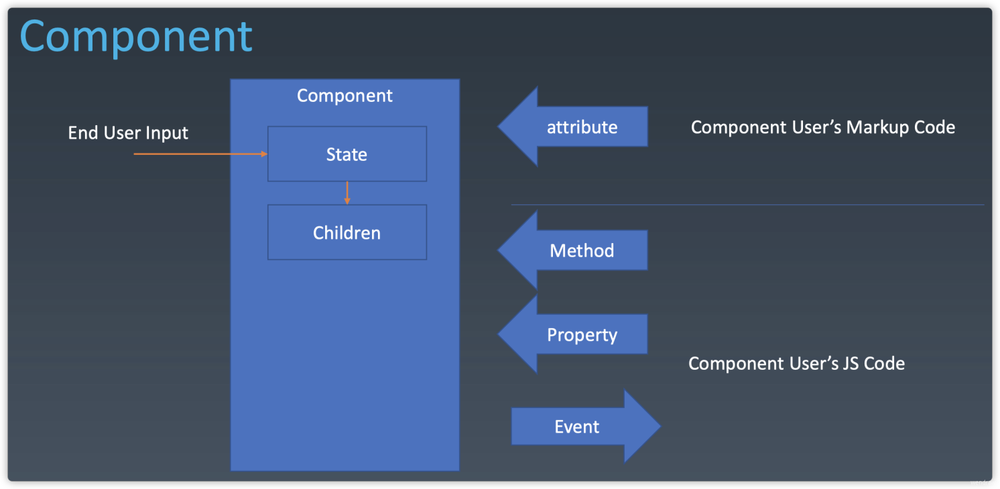
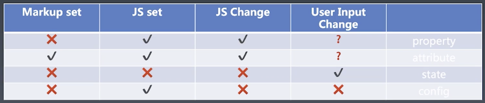

### 组件基本知识
前端架构里面最热门的两个话题，组件化、架构模式。
- 组件化，最基本的就是如果扩展html标签，达到复用的效果。
- 架构模式，例如MVC MVVM 主要是关心前端跟数据逻辑层如何交互。

对于前端来的组件化是重中之重，能提高代码复用，提高效率，而mvc模式这些，都由选择的框架决定了。比如vue mvvm.

组件区别于模块，区别于对象。一般组件是认为跟UI跟相关的东西，从某种意义上，既是模块，也是对象。它有树型结构，也是模板化的配置能力。

### 对象vs组件

- 对象
    - properties 属性
    - methods 方法
    - inherit 继承
- 组件  在对象的基础上添加6个特征
    - properties
    - methods
    - inherit
    - attritute  特性  下面会介绍property的区别
    - config  配置
    - state  状态
    - events   事件
    - lifecycle 生命周期
    - children  子组件



在这个图里面可以看到，**终端用户(end user input)** 改变组件的状态，这个状态可能还会影响到子组件。组件开发者，组件使用者通过attribute method property event进行交互。
其中 attribute 可能是标记语言 xml html, 一般来说，只接受字符串。

### attribute vs property

这两个单词都可以翻译成“属性”， 
- attribute 强调描述性的，比如说 很帅，头发很多 html的属性
- property 强调从属关系 子对象 父对象。   js 的 原型属性

实现使用中，有时候他们是一样的，有时也不一样。

---
一样
```html
// attribute
<my-component a="v />
myComponent.getAttribute('a');
myComponent.setAttribute('a','value');

// property

myComponent.a = 'value'

```
---

不一样
```html
<div class="cls1 cls2"></div>
<script>
    // attribute 名是 class 但js的property形式要用className
    let div = document.getElementsByTagName('div')[0];
    div.className  // cls1 cls2
</script>


<div style="width:12px;color:blue"></div>
<script>
    let div = document.getElementsByTagName('div')[0];
    div.style  // 返回的是object 而不是string
</script>

<a href="//baidu.com"></a>
<script>
    let a = document.getElementsByTagName('a')[0];
    a.href // https://bidu.com    url resolve的值
    a.getAttribute('href'); // //baidu.com 原始值
</script>

<!-- 还有神奇的input -->
<input value="hello" />
<script>
    let input = document.getElementsByTagName('input')[0];
    // 未设置value时， attribute跟property是一样的
    input.value // hello
    input.getAttribute('value'); // hello

    // attribute 相于一个默认值，property改变后，默认值不变
    input.value = "bye"; 
    input.value; // bye
    input.getAttribute("value") // hello
    
    // 设置property值后，attribute值改变也不会影响其显示值
    input.setAttribute("value", "1");
    input.value; // bye
    input.getAttribute("value") // 1
    
</script>
```

在jq里就有.attr  .prop问题，后期出现.val来统一解决这问题

### 如何设计组件状态



Property：不可以被 Markup（静态声明语言 html xml）设置，可以被 JS 设置和改变，有可能会根据用于输入而改变。
Attribute：可以被 Markup 设置，可以被 JS 设置和改变，有可能会根据用户输入而改变（一般不会）。
State：根据用户输入而改变。组件使用者，最好别修改state ,导致组件失控
Config：只能由 JS 去设置（config 一般是全局的，由构造函数传入，不会被修改）一次结果，不可更改。

### lifecycle 生命周期

最基本的就是
- created 创建
- destroyed 销毁 

中间过程  是可以反复发生的，比较组件if控制 回到created
- mount
- unmount

还有组件使用者 和 终端用户改变数据改变状态

- updata

一些日常使用的组件的生命周期是更详细化的定义。

### Children 

- content

组件内的放几个标签就是几个
```html
    <my-button>
    
    {{title}}
    </my-button>
```
- template
列表循环，根据数据，把组件内的模板进行循环，微信小程序view 
```html
    <my-list data={{data}} >
        <li>
            
            {{title}}
        </li>
    </my-list>


    <view wx:for="{{[1,2,4]}}">
        <view>{{item}}</view>
    </view>
```

### 总结

- 组件的重要性
- 组件比对象多的六个特征
- attribute 与 property的区别。如果定义，是否一样，就看大佬们的设计理念。
- 组件设计 state 只允许终端用户修改


