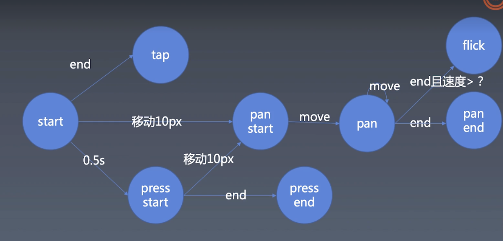

### 手势操作

#### 1.事件介绍 定义

先来看个图


- tap 点击事件 没有移动 误差10px 1倍屏就5px（经验值） 类似click
- press 按压 = 长按 500ms 没有移动
- pan  移动（摄影的术语）  
- flick 轻扫  start 到 end 的速度大于某个值

--- 

#### 2.主体逻辑 


**触摸事件** touchstart  move  end  cancel(可能被弹窗中断)
move end 不需要嵌套在start里面，哪个元素触发了了，就会哪个元素进行move 不管手指移到哪里
- 多点操作  event.changedTouches 数组了，用identifier来标识

```javascript
    {
        let element = document.documentElement;
        
        element.addEventListener('touchstart', e => {
            for(let touch of e.changedTouches) {
                start(touch);
            }
        })
        element.addEventListener('touchmove', e => {
            for(let touch of e.changedTouches) {
                move(touch);
            }
        })
        element.addEventListener('touchend', e => {
            for(let touch of e.changedTouches) {
                end(touch);
            }
        })
        element.addEventListener('touchcancel', e => {
            for(let touch of e.changedTouches) {
                cancel(touch);
            }
        })
        let start = (point) => {
            console.log('start');
        }
        let move = (point) => {
            console.log('move');
        }
        let end = (point) => {
            console.log('end');
        }
        let cancel = (point) => {
            console.log('cancel');
        }
    }
```
--- 

#### 3.tab press pan 实现
实现 tab press pan 事件（单点触摸）
具体逻辑按第一个图
```javascript
        let handler, startX, startY;
        // 默认为tap
        let isPan = false, isPress = false; isTap = true;
        let start = (point) => {
            // console.log('start', point);
            // 1. 500ms 无其它操作则为长按press
            handler = setTimeout(() => {
                isPan = false;
                isTap = false;
                isPress = true;
                handler = null
                console.log('press');
            }, 500);
            // 2. 保存startX startY 计算移动距离使用
            startX = point.clientX;
            startY = point.clientY;
        }
        let move = (point) => {
            // 3. 计算距离是否大于10px 为了省开方 直接用100比较  
            let dx = point.clientX - startX;
            let dy = point.clientY - startY;
            // 移动可能是来回移动的，标识后pan不需要再判断
            if (!isPan && dx ** 2 + dy ** 2 > 100) {
                isPan = true;
                isTap = false;
                isPress = false;
                clearTimeout(handler);
                console.log('panstart');
            }
            if (isPan) {
                console.log('pan');
            }
            // console.log('move', point);
        }
        let end = (point) => {
            // console.log('end', point);
            if (isTap) {
                console.log('tap');
                clearTimeout(handler);
            }
            if (isPan) {
                console.log('panend');
            }
            if (isPress) {
                console.log('pressend');
            }
            // 恢复默认, 要不然就再点状态就错了
            handler = null;
            isPan = false;
            isTap = true;
            isPress = false;
        }
        let cnacel = (point) => {
            clearTimeout(handler);
            // 恢复默认, 要不然就再点状态就错了
            handler = null;
            isPan = false;
            isTap = true;
            isPress = false;
            console.log('cnacel', point);
        }
```

--- 

#### 4.参数处理 

处理全局变量问题 handler, startX, startY;
多指触摸点，会产生多个touch，这里就不能使用全局了。
传入context，把参数挂在context上

创建单纯保存数据的对象，建议使用Object.create(null)创建，不需要对象的原型属性。

```javascript
{
        let element = document.documentElement;
        // 保存touchstart 创建的context
        let contexts = new Map();

        
        element.addEventListener('touchstart', e => {
            for(let touch of e.changedTouches) {
                // 创建context传入 并以identifier做key保存，在move end 中使用
                let context = Object.create(null);
                contexts.set(touch.identifier, context);
                start(touch, context);
            }
        })
        element.addEventListener('touchmove', e => {
            for(let touch of e.changedTouches) {
                move(touch, contexts.get(touch.identifier));
            }
        })
        element.addEventListener('touchend', e => {
            for(let touch of e.changedTouches) {
                end(touch, contexts.get(touch.identifier));
            }
        })
        element.addEventListener('touchcancel', e => {
            for(let touch of e.changedTouches) {
                cancel(touch, contexts.get(touch.identifier));
            }
        })
        // let handler, startX, startY;
        // // 默认为tap
        // let isPan = false, isPress = false; isTap = true;
        let start = (point, context) => {
            // 初始化
            context.isPan = false;
            context.isTap = true;
            context.isPress = false;


            // 1. 500ms 无其它操作则为长按press
            context.handler = setTimeout(() => {
                context.isPan = false;
                context.isTap = false;
                context.isPress = true;
                context.handler = null
                console.log('press');
            }, 500);
            // 2. 保存startX startY 计算移动距离使用
            context.startX = point.clientX;
            context.startY = point.clientY;
        }
        let move = (point, context) => {
            // 3. 计算距离是否大于10px 为了省开方 直接用100比较  
            let dx = point.clientX - context.startX;
            let dy = point.clientY - context.startY;
            // 移动可能是来回移动的，标识后pan不需要再判断
            if (!context.isPan && dx ** 2 + dy ** 2 > 100) {
                context.isPan = true;
                context.isTap = false;
                context.isPress = false;
                clearTimeout(context.handler);
                console.log('panstart');
            }
            if (context.isPan) {
                console.log('pan');
            }
            // console.log('move', point);
        }
        let end = (point, context) => {
            // console.log('end', point);
            if (context.isTap) {
                console.log('tap');
                clearTimeout(context.handler);
            }
            if (context.isPan) {
                console.log('panend');
            }
            if (context.isPress) {
                console.log('pressend');
            }
            // 恢复默认, 要不然就再点状态就错了
            contexts.delete(point.identifier);
            // handler = null;
            // isPan = false;
            // isTap = true;
            // isPress = false;
        }
        let cnacel = (point, context) => {
            clearTimeout(context.handler);
            // 恢复默认, 要不然就再点状态就错了
            contexts.delete(point.identifier);
            // handler = null;
            // isPan = false;
            // isTap = true;
            // isPress = false;
            console.log('cnacel', point);
        }
    }
```

#### 5.实现flick

- 需要判断移动速度来判断，建议值为1.5 (mac上怎样快速划，都到达不了1.5 - -！)
- 不能使用move 点与点的速度计算，这样的误差较大，每个浏览器的实现都不同
- 使用一段时间内，一堆点的平均值作比较

```javascript
    // flick 主要代码
        let start = (point, context) => {

            // flick: 收集点，用于计算移动速度
            context.points = [{
                t: Date.now(),
                x: point.clientX,
                y: point.clientY
            }];
        }
        let move = (point, context) => {
            // flick 精化部分 只保留500ms内移动的点
            // 刚开始还在思考来回移动时的速度很快，但计算出来的速度就慢问题。但从业务角度考虑，来回划，是不会触发flick才对
            context.points = context.points.filter(point => Date.now() - point.t < 500);
            context.points.push({
                t: Date.now(),
                x: point.clientX,
                y: point.clientY
            });
        }
        let end = (point, context) => {
            // flick 最后计算速度
            context.points = context.points.filter(point => Date.now() - point.t < 500);
            let v;
            if (context.points.length === 0) {
                v = 0;
            } else {
                let d = Math.sqrt((point.clientX - context.points[0].x) ** 2 + (point.clientY - context.points[0].y) ** 2 );
                v = d / (Date.now() - context.points[0].t);
            }
            console.log(v);
            if (v > 1.5) {
                // 1.5 像素每毫秒
                console.log('flick');
                context.isFlick = true;
            } else {
                context.isFlick = false;
            }
        }

```

#### 6.实现事件派发

Event  CustomEvent的区别？  TODO

- 传参 CustomEvent detail: {xxxxx}

- web worker ???

https://segmentfault.com/a/1190000018699594

```javascript

    function dispatch(type, properties) {
        let event = new Event(type);
        for(let name in properties) {
            event[name] = properties[name];
        }
        element.dispatchEvent(event);
    }

    document.documentElement.addEventListener('tap', e => {
        console.log('tap', e);
    })

```


